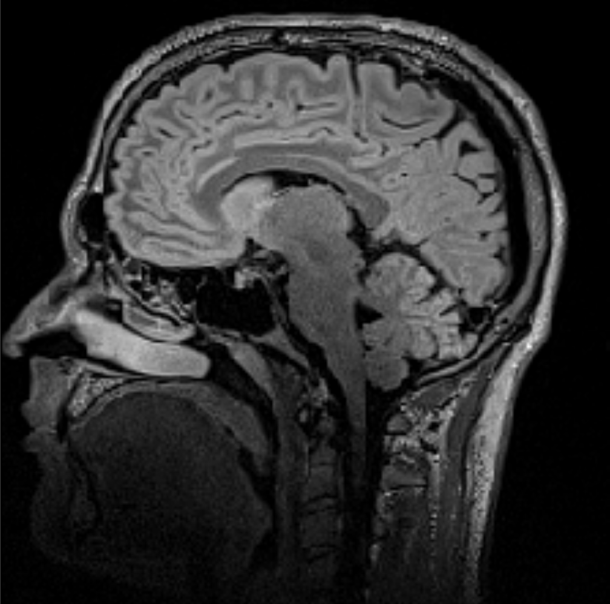

Title: DICOM in Python: Importing medical image data into NumPy with PyDICOM and VTK
Author: Adamos Kyriakou
Date: Friday September 6th, 2014
Tags: NumPy, DICOM, PyDICOM, VTK, Medical Image Processing, Matplotlib
Categories: Image Processing, IO

I'll be showing how to use the `pydicom` package and/or VTK to read a series of DICOM images into a NumPy array. This will involve reading metadata from the DICOM files and the pixel-data itself.

## Introduction: The DICOM standard [sec:intro] ##
Anyone in the medical image processing or diagnostic imaging field, will have undoubtedly dealt with the infamous [Digital Imaging and Communications in Medicine (DICOM) standard](http://en.wikipedia.org/wiki/DICOM) the de-facto solution to storing and exchanging medical image-data.

Applications such as [RadiAnt](http://www.radiantviewer.com/) or [MicroDicom](http://www.microdicom.com/) for Windows and [OsiriX](http://www.osirix-viewer.com) for Mac, do a great job of dealing with DICOM files. However, there are as many flavors of DICOM as there are of ice-cream. Thus, when it comes to programmatically reading and processing DICOM files things get a little hairier depending on whether the files store the pixel data in a compressed form or not.

In this post I will show how to read in **uncompressed** DICOM file series through either the `pydicom` package or VTK. Take a look at the [Resources section][sec:resources] for tips on how to tackle compressed DICOM files.

### DICOM Datasets [sec:datasets] ###
There's a wealth of freely available DICOM datasets online but here's a few that should get you started:

- [Osirix Datasets](http://www.osirix-viewer.com/datasets/): This is my personal favorite as it provides a large range of human datasets acquired through a variety of imaging modalities. 
- [Visible Human Datasets](https://mri.radiology.uiowa.edu/visible_human_datasets.html): Parts of the [Visible Human project](http://www.nlm.nih.gov/research/visible/visible_human.html) are somehow freely distributed here which is weird cause [getting that data](http://www.nlm.nih.gov/research/visible/getting_data.html) is neither free nor hassle-free.
- [The Zubal Phantom](http://noodle.med.yale.edu/zubal/): This website offers multiple datasets of two human males in CT and MRI which are freely distributed. 

Despite the fact that its easy to get DICOM datasets, most databases forbid their re-distribution by third parties. Therefore, for the purposes of these posts I decided to use a dataset from an MR examination of my own fat head. You can find a .zip file with with .dcm files on the [sagittal plane](http://en.wikipedia.org/wiki/Anatomical_terms_of_location) [here](https://bitbucket.org/somada141/pyscience/raw/master/20140906_PythonDicom/Material/MyHead.zip). In order to follow this post extract the contents of this file alongside the IPython Notebooks, the contents of which I'll be presenting in the [`pydicom` Usage section][sec:pydicom:usage] and the [VTK Usage section][sec:vtk:usage].

## The `pydicom` package [sec:pydicom] ##
In this, first of two posts I will show how to use the [`pydicom`](https://pypi.python.org/pypi/pydicom/) package, which consists of pure-python code, is [hosted on pypi](https://pypi.python.org/pypi/pydicom/), and can be easily installed through `pip` as such:

```
pip install pydicom
```

> As is often the case with many Python packages, while this package is called `pydicom` it simply goes by `dicom` within Python and needs to be imported with `import dicom`.

### Usage [sec:pydicom:usage] ###
In this example I'm gonna use the MR dataset of my own head, discussed in the [DICOM Datasets section][sec:datasets], and the `pydicom` package, to load the entire series of DICOM data into a 3D NumPy array and visualize two slices through `matplotlib`. You can find the entire IPython Notebook [here](http://nbviewer.ipython.org/urls/bitbucket.org/somada141/pyscience/raw/master/20140906_PythonDicom/Material/PythonDicomPyDicom.ipynb).

Obviously we'll start with importing the packages we'll need:

```
import dicom
import os
import numpy
from matplotlib import pyplot, cm
```

The only point of interest here is, as I mentioned in the [The `pydicom` package section][sec:pydicom], that the `pydicom` package is imported as `dicom` so be careful with that. Next we use `os.path.walk` to traverse the `MyHead` directory, and collect all `.dcm` files into a `list` named `lstFilesDCM`:

```
PathDicom = "./MyHead/"
lstFilesDCM = []  # create an empty list
for dirName, subdirList, fileList in os.walk(PathDicom):
    for filename in fileList:
        if ".dcm" in filename.lower():  # check whether the file's DICOM
            lstFilesDCM.append(os.path.join(dirName,filename))
```

> If you check the `MyHead` folder you'll see that the `.dcm` files are named `MR000000.dcm`, `MR000001.dcm`, etc. Therefore, the `walk` function will return them in order since they're [sorted lexicographically](http://en.wikipedia.org/wiki/Lexicographical_order) by the OS. However, in many cases DICOM files don't have all those leading zeros, with names like `MR1`, `MR2`, etc which would result in `lstFilesDCM` having the filenames ordered in a fashion such as `MR1`, `MR10`, `MR100`, etc. Since, the typical sorting functions in python, such as `sorted` and the `sort` method of `list` objects (docs [here](https://wiki.python.org/moin/HowTo/Sorting)),  are lexicographical as well (unless dealing with pure numbers), I strongly suggest using the very useful `natsort` package which can be found on PyPI [here](https://pypi.python.org/pypi/natsort) (and can be installed with a simple `pip install natsort`).

Now, lets get into the `pydicom` part of the code. A notable aspect of this package is that upon reading a DICOM file, it creates a `dicom.dataset.FileDataset` object where the different metadata are assigned to object attributes with the same name. We'll see this below:

```
# Get ref file
RefDs = dicom.read_file(lstFilesDCM[0])

# Load dimensions based on the number of rows, columns, and slices (along the Z axis)
ConstPixelDims = (int(RefDs.Rows), int(RefDs.Columns), len(lstFilesDCM))

# Load spacing values (in mm)
ConstPixelSpacing = (float(RefDs.PixelSpacing[0]), float(RefDs.PixelSpacing[1]), float(RefDs.SliceThickness))
```

In the first line we load the 1st DICOM file, which we're gonna use as a reference named `RefDs`, to extract metadata and whose filename is first in the `lstFilesDCM` list. We then calculate the total dimensions of the 3D NumPy array which are equal to (Number of pixel rows in a slice) x (Number of pixel columns in a slice) x (Number of slices) along the x, y, and z cartesian axes. Lastly, we use the `PixelSpacing` and `SliceThickness` attributes to calculate the spacing between pixels in the three axes. We store the array dimensions in `ConstPixelDims` and the spacing in `ConstPixelSpacing`.

> If you were to open one of the DICOM files with an application such as the ones mentioned in the [Intro section][sec:intro] and checked the metadata you'd see that `Rows`, `Columns`, `PixelSpacing`, and `SliceThickness` are all metadata entries. `pydicom` simply creates attributes with the same names and assigns appropriate values to those, making them easily accessible.

The next chunk of code is:

```
x = numpy.arange(0.0, (ConstPixelDims[0]+1)*ConstPixelSpacing[0], ConstPixelSpacing[0])
y = numpy.arange(0.0, (ConstPixelDims[1]+1)*ConstPixelSpacing[1], ConstPixelSpacing[1])
z = numpy.arange(0.0, (ConstPixelDims[2]+1)*ConstPixelSpacing[2], ConstPixelSpacing[2])
```

where we simply use `numpy.arange`, `ConstPixelDims`, and `ConstPixelSpacing` to calculate axes for this array. Next, comes the last `pydicom` part:

```
# The array is sized based on 'ConstPixelDims'
ArrayDicom = numpy.zeros(ConstPixelDims, dtype=RefDs.pixel_array.dtype)

# loop through all the DICOM files
for filenameDCM in lstFilesDCM:
    # read the file
    ds = dicom.read_file(filenameDCM)
    # store the raw image data
    ArrayDicom[:, :, lstFilesDCM.index(filenameDCM)] = ds.pixel_array  
```

As you can see, what we do here is first create a NumPy array named `ArrayDicom` with the dimensions specified in `ConstPixelDims` calculated before. The `dtype` of this array is the same as the `dtype` of the `pixel_array` of the reference-dataset `RefDs` which we originally used to extract metadata. The point of interest here is that the `pixel_array` object is a pure NumPy array containing the pixel-data for the particular DICOM slice/image. Therefore, what we do next is loop through the collected DICOM filenames and use the `dicom.read_file` function to read each file into a `dicom.dataset.FileDataset` object. We then use the `pixel_array` attribute of that object, and toss it into `ArrayDicom`, stacking them along the z axis.

And that's it! Using the `pyplot` module in `matplotlib` we can create a nice lil' plot as such:

```
pyplot.figure(dpi=300)
pyplot.axes().set_aspect('equal', 'datalim')
pyplot.set_cmap(pyplot.gray())
pyplot.pcolormesh(x, y, numpy.flipud(ArrayDicom[:, :, 80]))
```

which results in the following image:



## Reading DICOM through VTK [sec:vtk] ##
Now while skimming the previous section you might have thought 'pfff that's way too easy, why did we bother reading your rants?'. Well, in the interest of keeping you interested, I decided -- against my better judgement -- to provide the VTK approach to the above process.

### Usage [sec:vtk:usage] ###
You can find a separate notebook [here](http://nbviewer.ipython.org/urls/bitbucket.org/somada141/pyscience/raw/master/20140906_PythonDicom/Material/PythonDicomVTK.ipynb), while I'll be using the same dataset. Make sure to check that notebook cause I'll only be detailing the VTK parts of the code here. You will find that the VTK solution is quite a bit more succinct. Now let's start with reading in the series of `.dcm` files:

```
PathDicom = "./MyHead/"
reader = vtk.vtkDICOMImageReader()
reader.SetDirectoryName(PathDicom)
reader.Update()
```

As you can see, unlike the approach in the [previous section][sec:pydicom:usage], here we saved ourselves the two loops, namely populating the filename list, and reading in the data slice-by-slice. We first create a `vtkDICOMImageReader` object (docs [here](http://www.vtk.org/doc/nightly/html/classvtkDICOMImageReader.html)), and pass the path to the directory where all the `.dcm` files are through the `SetDirectoryName` method. After that, its just a matter of calling the `Update` method which does all the reading. If you were dealing with huge datasets, you'd be surprised how much faster than `pydicom` VTK does that.

> Don't let the above approach fool you entirely. It worked only cause the OS sorted the files correctly by itself. As I mentioned in the [previous section][sec:pydicom:usage], if the files weren't properly named, lexicographical sorting would have given you a messed up array. In that case you would either need to loop and pass each file to a separate `reader` through the `SetFileName` method, or you'd have to create a `vtkStringArray`, push the sorted filenames, and use the `vtkDICOMImageReader.SetFileNames` method. Keep your eyes open! VTK is not forgiving :)

Next we need access to the metadata in order to calculate those `ConstPixelDims` and `ConstPixelSpacing` variables:

```
# Load dimensions using `GetDataExtent`
_extent = reader.GetDataExtent()
ConstPixelDims = [_extent[1]-_extent[0]+1, _extent[3]-_extent[2]+1, _extent[5]-_extent[4]+1]

# Load spacing values
ConstPixelSpacing = reader.GetPixelSpacing()
```

As you can see, the `vtkDICOMImageReader` class comes with a few useful methods that provide the metadata straight-up. However, only a few of those values are available in a straightforward manner. Thankfully, by using the `GetDataExtent` method of the `reader` we get a 6-value tuple with the starting and stopping indices of the resulting array on all three axes. Obviously, that's all we need to calculate the size of the array. Getting the pixel-spacing is even easier than with `pydicom` and simply accomplished with the `GetPixelSpacing` method.

Now, onto the fun part :). You might have read my [previous post](https://pyscience.wordpress.com/2014/09/06/numpy-to-vtk-converting-your-numpy-arrays-to-vtk-arrays-and-files/) on how to convert arrays between NumPy and VTK. You might have thought that we can use that functionality and get a nice NumPy array with a one-liner. Well, I hate to disappoint you but it's not that straightforward (remember, VTK).

If you dig a little into the [`vtkDICOMImageReader` docs](http://www.vtk.org/doc/nightly/html/classvtkDICOMImageReader.html), you will see that it inherits [`vtkImageReader2`](http://www.vtk.org/doc/nightly/html/classvtkImageReader2.html), which in turn inherits [`vtkImageAlgorithm`](http://www.vtk.org/doc/nightly/html/classvtkImageAlgorithm.html). The latter, sports a `GetOutput` method returning a `vtkImageData` object pointer. However, the `numpy_support.vtk_to_numpy` function only works on `vtkArray` objects so we need to dig into the `vtkImageData` object till we get that type of array. Here's how we do that:

```
# Get the 'vtkImageData' object from the reader
imageData = reader.GetOutput()
# Get the 'vtkPointData' object from the 'vtkImageData' object
pointData = imageData.GetPointData()
# Ensure that only one array exists within the 'vtkPointData' object
assert (pointData.GetNumberOfArrays()==1)
# Get the `vtkArray` (or whatever derived type) which is needed for the `numpy_support.vtk_to_numpy` function
arrayData = pointData.GetArray(0)

# Convert the `vtkArray` to a NumPy array
ArrayDicom = numpy_support.vtk_to_numpy(arrayData)
# Reshape the NumPy array to 3D using 'ConstPixelDims' as a 'shape'
ArrayDicom = ArrayDicom.reshape(ConstPixelDims, order='F')
```

As you can see, we initially use `reader.GetOutput()` to get a `vtkImageData` object pointer into `imageData`. We then use the `GetPointData` method of that object to 'extract' a `vtkPointData` object pointer into `pointData`. Now, these `vtkPointData` may hold multiple arrays but we should only have one in there (being the entirety of the DICOM data). Since these 'internal' arrays are numerically indexed, we get this `vtkArray` through index `0` so the array we were looking for can be retrieved through `arrayData = pointData.GetArray(0)`. We can now finally 'convert' that pesky array to NumPy through `vtk_to_numpy` and store it in `ArrayDicom`. As a final step, we `reshape` that array using `ConstPixelDims` et voila!

From that point, we use our lovely NumPy array and get the same plots we got with the previous approach.

> Note that we reshape `ArrayDicom` with a 'Fortran' order. Don't ask me why, but when I tried to `reshape` in `C` order I got misaligned rubbish so there. Trial-n-error.

## Resources [sec:resources] ##

Should you want to learn more about `pydicom` do check the project's [official website](https://code.google.com/p/pydicom/), its [wiki](https://code.google.com/p/pydicom/w/list), and its [user guide](https://code.google.com/p/pydicom/wiki/PydicomUserGuide).

'Whoa' you might say though, what about those JPEG-based compressed DICOM files you mentioned in the [intro][sec:intro]?. Well unfortunately, neither `pydicom`, nor the admittedly convenient `vtkDICOMImageReader` class can handle those. At least, the `pydicom` package will warn you and return a `NotImplementedError` upon reading such a DICOM file, while VTK will just return an array full of 0s and leave you wondering. At this point I can only think of two viable solutions to this:

- Go the hardcore route, install the [GDCM library](http://gdcm.sourceforge.net/wiki/index.php/Main_Page)  with Python bindings on your system, and use the [`mudicom` package](https://pypi.python.org/pypi/mudicom/0.0.6) to handle it in Python. GDCM is a breeze to [install on Windows and Linux systems](http://gdcm.sourceforge.net/wiki/index.php/Installing_GDCM_2.4.0) as it provides [pre-compiled binaries](http://sourceforge.net/projects/gdcm/files/gdcm%202.x/GDCM%202.4.0/) for those. You should also be able to install it on Mac using [Homebrew](http://brew.sh/) and [this recipe](https://gist.github.com/kyoma-/7955288) but I haven't tested it yet.
- Go the cheater's route, or as I like to call it the lazy engineer's route. Simply open that data in one of the applications mentioned in the [Intro][sec:intro], such as [OsiriX](http://www.osirix-viewer.com), and save it as uncompressed DICOM (yes you can do that).

---

Anyway, enough for today, hope you've learned enough to start butchering medical image data on your own, as there are a million awesome things you can do with those. We'll see a few nifty things in subsequent posts. Next up, I'm going to regale you with bone-chilling tales of marching-cubes and surface extraction :). Thanks for reading!