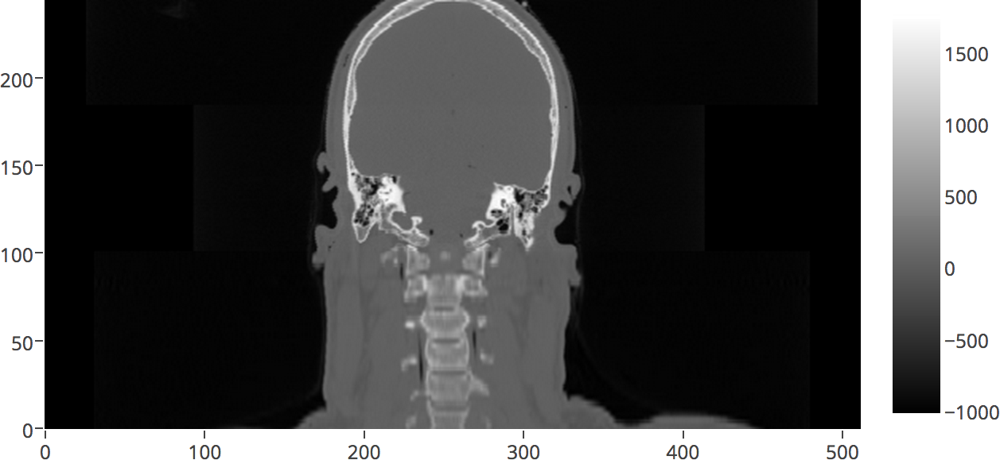
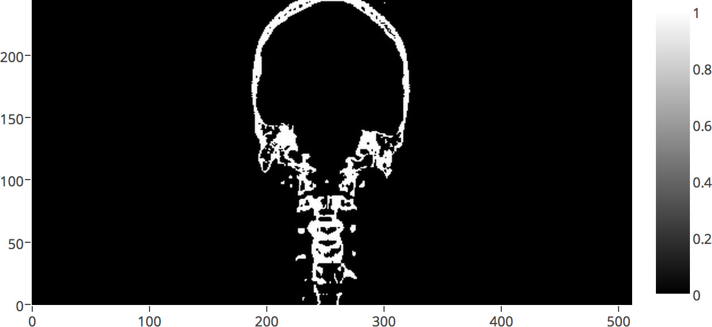
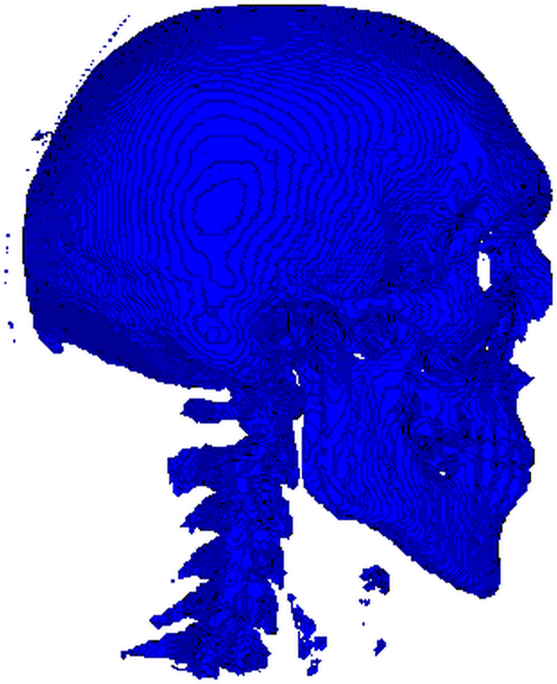

Title: Surface Extraction: Creating a mesh from pixel-data using Python and VTK
Author: Adamos Kyriakou
Date: Friday September 8th, 2014
Tags: Python, DICOM, VTK, Medical Image Processing, Plotly, Marching Cubes, Surface Extraction, Image Segmentation
Categories: Image Processing, IO, Visualization

In this post I will demonstrate how to use VTK to read in a series of DICOM files from a CT examination and extract a mesh surface of the bone structures. I will then show you how to visualize the mesh with VTK and save it, the mesh that is, into an STL file.

## Introduction
After the [last post](http://pyscience.wordpress.com/2014/09/08/dicom-in-python-importing-medical-image-data-into-numpy-with-pydicom-and-vtk/) on importing DICOM data with `pydicom` or VTK, you should've realized that VTK isn't just about visualization as the name would suggest. Pain in the a** as it is to learn, VTK offers some fantastic image-processing functionality which you just can't find in pure python libraries. What's more is that even if you do find it, chances are it will be rather limited and most certainly computationally slow for real-world applications (still love Python more though, don't get me wrong).

Case in point, in this post I will show you how to use the VTK Python bindings to extract a mesh-surface from a 3D volume, a process commonly termed as surface extraction, using the [marching cubes algorithm](http://en.wikipedia.org/wiki/Marching_cubes) implemented in the [vtkDiscreteMarchingCubes](http://www.vtk.org/doc/release/5.0/html/a01331.html) class. I'll be using a DICOM dataset of a CT examination which we will load with VTK, exactly as was shown in the [last post](http://pyscience.wordpress.com/2014/09/08/dicom-in-python-importing-medical-image-data-into-numpy-with-pydicom-and-vtk/), threshold it to isolate the bone-structures based on the [Hounsfield scale](http://en.wikipedia.org/wiki/Hounsfield_scale), and then create a single mesh-surface of all the bones. Upon generating that surface, I'll show you how to visualize that directly into the IPython Notebook, as well as how to save that surface as an [STL file](http://en.wikipedia.org/wiki/STL_(file_format)) for external post-processing and visualization.

> If for some reason you don't have `vtk` installed in your python distro, then once more I suggest you use the [Anaconda distro](https://store.continuum.io/cshop/anaconda/), of which I wrote in [this previous post](http://pyscience.wordpress.com/2014/09/01/anaconda-the-creme-de-la-creme-of-python-distros-3/), and install it via `conda install vtk`.

Before I continue, I should note that there is an implementation of marching cubes in the `scikit-image` package under the `measure` module. You can find the docs [here](http://scikit-image.org/docs/dev/api/skimage.measure.html?highlight=marching_cubes#marching-cubes), while a very nice tutorial on it can be found [here](http://scikit-image.org/docs/dev/auto_examples/plot_marching_cubes.html).

However, having tested both approaches extensively, I've found that the VTK implementation is more robust, way faster, and results in better mesh quality. And in any case, its really easy to adapt the aforementioned tutorial to your needs, and I assume you don't need a post on that (if you do then feel free to let me know and I'll be happy to oblige). What you would do is simply load the DICOM data into a NumPy array as I showed [last time](http://pyscience.wordpress.com/2014/09/08/dicom-in-python-importing-medical-image-data-into-numpy-with-pydicom-and-vtk/) using `pydicom`, and then use the `skimage.measure.marching_cubes` function mentioned above.

## Background
The example I will be showing today is a very common procedure in biomedical engineering, and falls under the category of [medical image segmentation](http://en.wikipedia.org/wiki/Image_segmentation).  In a nutshell, this process allows us to go from the grayish blur that are medical image datasets, to a label-field where each tissue or anatomical structure is characterized by an index, and eventually to a nifty 3D model of the anatomical body that underwent imaging.

As I will be using a [computed tomography (CT)](http://en.wikipedia.org/wiki/Image_segmentation) dataset, I thought I'd explain a few core-concepts so that you can understand the rationale behind the approach and see that its actually scientifically viable (and not just a meaningless example).

### The Hounsfield Scale
The [Hounsfiled scale](http://en.wikipedia.org/wiki/Hounsfield_scale) is a quantitative measure of radiodensity. Pixels in an image obtained by CT scanning are displayed in terms of relative radiodensity. The pixel value is displayed according to the mean attenuation of the tissue that it corresponds to on a scale from -1024 to over 3000 on the Hounsfield scale. Water has an attenuation of 0 Hounsfield units (HU) while air is -1000 HU, bone is typically +400 HU or greater and metallic implants are usually +1000 HU.

Therefore, the pixel-data in a CT image give us a direct way to roughly identify the tissue type each pixel belongs to. Thus, simply by means of thresholding the image to known ranges, we can extract given types of tissue straight from the image without hassle! How great is that?! In case you're not impressed then let me mention that the manual segmentation of medical image data and the creation of label-fields is the most arduous, soul-sucking, repetitive procedure in the field of biomedical engineering!

What we'll do in the example is use such a CT dataset, threshold it to values over 400 HU, thus isolating all bone-structures, and then use the [marching cubes algorithm](http://en.wikipedia.org/wiki/Marching_cubes) to create a beautiful 3D mesh of those structures.

> [Converting raw pixel-data to HU](https://www.idlcoyote.com/fileio_tips/hounsfield.html): This is actually very important for real-world examples so pay attention! A typical CT image is not saved directly in HU. In 99% of the cases the 'raw' pixel-data needs to be rescaled. Therefore, DICOM images of CT examinations typically contain two values in their metadata, most commonly called `RescaleSlope` and `RescaleIntercept`. These values are simply the `a` and `b` in a typical linear transformation. The [formula](https://www.idlcoyote.com/fileio_tips/hounsfield.html) for calculating the HU out of the raw pixel-data is `hu = pixel_value * slope + intercept`. While the [`vtkDICOMImageReader`](http://www.vtk.org/doc/nightly/html/classvtkDICOMImageReader.html) class we'll be using here applies this rescaling internally, that is not the case with all DICOM libraries, `pydicom` for example doesn't do that, so be careful!

### The 'Visible Human' Dataset
Much as I would've liked to use the dataset of my own head as I did in the [last post](http://pyscience.wordpress.com/2014/09/08/dicom-in-python-importing-medical-image-data-into-numpy-with-pydicom-and-vtk/), I needed a CT examination dataset for the purposes of this post and no physician would agree to bombard my head with a ridiculous amount of radiation just so I can play around with it (bunch of pedantic prudes :) ). In fact, the majority of openly available CT datasets are acquired from cadavers.

In case you're not in the biomed field then you may not have heard of the ['Visible Human' project](http://en.wikipedia.org/wiki/Visible_Human_Project), where the body of an executed convict was frozen, cut in 1mm slices, and extensively photographed and imaged with MR and CT. Well, this jolly story gave us the invaluable dataset we'll be working with today!

As I mentioned in the [previous post](http://pyscience.wordpress.com/2014/09/08/dicom-in-python-importing-medical-image-data-into-numpy-with-pydicom-and-vtk/), [getting the 'Visible Human' data](http://www.nlm.nih.gov/research/visible/getting_data.html) requires one to [pay a hefty price of a couple Gs](http://www.ntis.gov/products/vishuman.aspx), and sign a bunch or license agreements. Obviously, that would be too much for a humble blogger :).

However, I came across [this wonderful website](https://mri.radiology.uiowa.edu/visible_human_datasets.html) which distributes loose sections of that data without any license agreement in sight and no expressed restrictions. In my book, that's a green light :). I batch-downloaded the DICOM images, and I suggest you do too before they realize what they've done, and I'll be using the head section of the 'Visible Male' CT data. You can find a `.zip` file of those images [here](https://bitbucket.org/somada141/pyscience/raw/master/20140908_SurfaceExtraction/Material/vhm_head.zip).

## Surface-Extraction: Marching-Cubes and VTK

Now let's get to it shall we? As always I've put together an IPython Notebook of the entire process which you can find [here](http://nbviewer.ipython.org/urls/bitbucket.org/somada141/pyscience/raw/master/20140908_SurfaceExtraction/Material/SurfaceExtractionVTK.ipynb), while as I mentioned above, you can find the dataset, which you should extract next to the notebook, [here](https://bitbucket.org/somada141/pyscience/raw/master/20140908_SurfaceExtraction/Material/vhm_head.zip).

### Function tools

As I love reusing code, you will see in [the notebook](http://nbviewer.ipython.org/urls/bitbucket.org/somada141/pyscience/raw/master/20140908_SurfaceExtraction/Material/SurfaceExtractionVTK.ipynb) that I've created three convenient functions based on material I presented in previous posts. These are:

- `vtkImageToNumPy(image, pixelDims)`: This function allows me to quickly convert a `vtkImageData` object to a 3D `numpy.ndarray` which I only use to create quick 2D plots of the data with [Plotly](https://plot.ly). This code was presented in this [past post on converting arrays between VTK and NumPy](http://pyscience.wordpress.com/2014/09/06/numpy-to-vtk-converting-your-numpy-arrays-to-vtk-arrays-and-files/).
- `plotHeatmap(array, name="plot")`: This function uses [Plotly](https://plot.ly) to create a 'heatmap' of a 2D `numpy.ndarray` which I use to quickly examine the data throughout the process. This code was presented in this [past post on converting arrays between VTK and NumPy](http://pyscience.wordpress.com/2014/09/06/numpy-to-vtk-converting-your-numpy-arrays-to-vtk-arrays-and-files/), while the usage of [Plotly](https://plot.ly) in an IPython Notebook was presented in [this past post](http://pyscience.wordpress.com/2014/09/02/interactive-plotting-in-ipython-notebook-part-22-plotly-2/).
- `vtk_show(renderer, width=400, height=300)`: This function allows me to pass a `vtkRenderer` object and get a IPython Notebook compatible image output of that render with given dimensions. This code was presented in this [past post about VTK integration with an IPython Notebook](http://pyscience.wordpress.com/2014/09/03/ipython-notebook-vtk/).

As I've already presented this code, I won't bother explaining its inner-workings again but you will see it being used throughout this post and the [accompanying notebook](http://nbviewer.ipython.org/urls/bitbucket.org/somada141/pyscience/raw/master/20140908_SurfaceExtraction/Material/SurfaceExtractionVTK.ipynb).

### Reading in the DICOM files
I'm well aware that I showed you how to do this in the [last post](http://pyscience.wordpress.com/2014/09/08/dicom-in-python-importing-medical-image-data-into-numpy-with-pydicom-and-vtk/) so I won't explain the code in detail but I wanted to emphasize the importance of the [`vtkDICOMImageReader` class](http://www.vtk.org/doc/nightly/html/classvtkDICOMImageReader.html), and its role in the entire procedure.

```
PathDicom = "./vhm_head/"
reader = vtk.vtkDICOMImageReader()
reader.SetDirectoryName(PathDicom)
reader.Update()

_extent = reader.GetDataExtent()
ConstPixelDims = [_extent[1]-_extent[0]+1, _extent[3]-_extent[2]+1, _extent[5]-_extent[4]+1]
ConstPixelSpacing = reader.GetPixelSpacing()
```

Just like in the [previous post](http://pyscience.wordpress.com/2014/09/08/dicom-in-python-importing-medical-image-data-into-numpy-with-pydicom-and-vtk/), we create a new [`vtkDICOMImageReader`](http://www.vtk.org/doc/nightly/html/classvtkDICOMImageReader.html) under the name of `reader` which we use to read the DICOM images. Subsequently, we use built-in methods of the `vtkDICOMImageReader` class to retrieve meta-data values and calculate the dimensions of the 3D array and the pixel spacing, storing it in `ConstPixelDims` and `ConstPixelSpacing`. The important thing to remember here is that the `reader` is the object that holds all that information in its member-variables.

As I mentioned in the 'Hounsfield Scale' section, CT data read from DICOM files need to first be rescaled by applying a linear transformation with the [formula](https://www.idlcoyote.com/fileio_tips/hounsfield.html) for calculating the HU out of the raw pixel-data being `hu = pixel_value * slope + intercept`. However, this appears to be done internally with [`vtkDICOMImageReader`](http://www.vtk.org/doc/nightly/html/classvtkDICOMImageReader.html) as the pixel values for the different tissues appear to be in the correct range (as you'll see in the plot later on). However, if linear transformation was needed, let me show you how it would have been done:

```
shiftScale = vtk.vtkImageShiftScale()
shiftScale.SetScale(reader.GetRescaleSlope())
shiftScale.SetShift(reader.GetRescaleOffset())
shiftScale.SetInputConnection(reader.GetOutputPort())
shiftScale.Update()
```

Now I repeat: this should **not** be done in this example as it has already been taken care of. This is just FYI. First we would start by creating a new [`vtkImageShiftScale`](http://www.vtk.org/doc/nightly/html/classvtkImageShiftScale.html) object under 'shiftScale'. We would then use the `shiftScale.SetScale` method to set the scale to 'RescaleSlope' which is retrieved through the `reader.GetRescaleSlope()` (note we're using the `reader` object to acquire that value). Similarly we'd set the shift through `shiftScale.SetShift` and `reader.GetRescaleOffset()` and the rest is just setting up the pipeline between the `reader` and the `shiftScale` and updating the latter. What's important here, is that if we did that then the image-data we would be using from this point forward would come from `shiftScale` and not the `reader` as we would want to 'operate' on the modified data and not the original.

At this point we have the image-data in place and ready to be processed. Using the 'function tools', we create a quick conversion of the `vtkImageData` object residing within the `reader` to a NumPy array create a plot with Plotly as such:

```
ArrayDicom = vtkImageToNumPy(reader.GetOutput(), ConstPixelDims)
plotHeatmap(numpy.rot90(ArrayDicom[:, 256, :]))
```

We create this nifty little plot seen below of a cross-section through the body. Note that we use `numpy.rot90` to rotate the image data by `90 deg` to make the resulting plot more 'legible'. You will see that the air surrounding the body has a HU value of `-1000`, soft tissue like brain-matter has HU values of `20 - 50`, while bone-structures range from ca. `400` HU and up. Just the type of values we would expect based on the [Hounsfield scale](http://en.wikipedia.org/wiki/Hounsfield_scale).



> As you might remember from the [Plotly post](http://pyscience.wordpress.com/2014/09/02/interactive-plotting-in-ipython-notebook-part-22-plotly-2/), the resulting plot is very much interactive allowing for zoom, pan, and hover-tooltip operations. However, WordPress wouldn't allow me to embed it in this post, some paranoid security feature I guess, so do check it on the [accompanying notebook](http://nbviewer.ipython.org/urls/bitbucket.org/somada141/pyscience/raw/master/20140908_SurfaceExtraction/Material/SurfaceExtractionVTK.ipynb) and explore the HU values of the different tissues.

### Thresholding the data

Now let's get onto the fun part :). What we have now is the HU of the CT image stored within the `vtkDICOMImageReader` object named `reader`. As I explained in the 'Introduction' what we need to do next is use the fact that bone-structures exhibit HU values of 400 and above. Thus we need to apply thresholding, mask out all non-bone tissue from the image, and create a... bone-mask if you will. Let's see how we'll do that:

```
threshold = vtk.vtkImageThreshold ()
threshold.SetInputConnection(reader.GetOutputPort())
threshold.ThresholdByLower(400)  # remove all soft tissue
threshold.ReplaceInOn()
threshold.SetInValue(0)  # set all values below 400 to 0
threshold.ReplaceOutOn()
threshold.SetOutValue(1)  # set all values above 400 to 1
threshold.Update()
```

Firstly, we create a [`vtkImageThreshold`](http://www.vtk.org/doc/nightly/html/classvtkImageThreshold.html) object named `threshold`. We add it to the VTK pipeline by 'connecting' its input to the 'output' of the `reader`. In layman's terms what the `threshold.SetInputConnection(reader.GetOutputPort())` command does is pass the pointer of the `vtkImageArray` residing under `reader` to `threshold`. Thusly, we have no overhead and no memory-copying. Hence the term `pipeline` I've been using so liberally :).

Subsequently,  we use the `ThresholdByLower` method of the `vtkImageThreshold` class, calling it as `threshold.ThresholdByLower(400)`. What we tell `threshold` here is that all pixels with HU values below `400`, i.e., soft-tissue, are *in-range*. Therefore, all pixels with HU values above `400`, i.e., bone-structures, lie in the *out-range*. We'll see what this means.

We then call `threshold.ReplaceInOn()` which tells `threshold` that we intend to replace all *in-range* pixel-values in the array with another value. In this case, as we want to clear out all soft tissue, that value will be `0` which we accomplish through `threshold.SetInValue(0)`. Following a similar rationale, we call `threshold.ReplaceOutOn()` allowing us to replace all *out-range* pixel-values with another value which we set to `1` through `threshold.SetOutValue(1)`. What we did here is essentially create a boolean-mask where all pixels representing bones were set to `True` and all other pixels to `False`. We'll see why we did that below.

Lastly, we just call `threshold.Update()`, thus enforcing the thresholding and presto! A quick plot with Plotly as we did before shows us the thresholded array below.



### Extracting the surface
So here we are, the most interesting and yet shortest part of the code, i.e., the surface extraction. At this point, we have the 'boolean-array' we created above by means of thresholding which can be considered to be a label-field with only two labels: `1` for the bones and `0` for everything else.

As stated prior we're gonna use an implementation of the [marching cubes algorithm](http://en.wikipedia.org/wiki/Marching_cubes) implemented in the [vtkDiscreteMarchingCubes](http://www.vtk.org/doc/release/5.0/html/a01331.html) class. What this class does is "generate object boundaries from labelled volumes" which it achieves by taking "as input a volume (e.g., 3D structured point set) of segmentation labels and generates on output one or more models representing the boundaries between the specified label and the adjacent structures. One or more label values must be specified to generate the models". Check the [docs](http://www.vtk.org/doc/release/5.0/html/a01331.html) if you want to learn more as I'm not going to explain how 'marching-cubes' works. Just take my word for it when I say its practically the de-facto solution for surface extraction from a volume.

Now don't be surprised when you see how little code is needed to achieve our goal:

```
dmc = vtk.vtkDiscreteMarchingCubes()
dmc.SetInputConnection(threshold.GetOutputPort())
dmc.GenerateValues(1, 1, 1)
dmc.Update()
```

By now you should be familiar with the creation of a new VTK object and its addition to the pipeline. What we do here is create a new `vtkDiscreteMarchingCubes` object under `dmc` and add it to the pipeline. What's important to note is the sequential nature of this pipeline as we connect `dmc` to the `threshold` since we need to perform the marching-cubes operation on the thresholded array and not the original.

Before I explain the 3rd line, which is the important one, let me quickly show you the signature of the `GenerateValues` method which actually 'belongs' to the `vtkMarchingCubes` class, the parent class of `vtkDiscreteMarchingCubes`. The docs for that can be found [here](http://www.vtk.org/doc/release/5.0/html/a01703.html#z2018_0). The signature is the following:

```
void vtkMarchingCubes::GenerateValues(int numContours, double rangeStart, double rangeEnd)
```

As you can see, the first parameter is the number of contours or iso-surfaces we want to generate. The next two parameters are the label-index range we want to account for. As you can understand, this class allows us to create multiple surfaces based on a label-field with several indices, resulting in several surfaces. 

However, that it not the case for our example. We merely want to create `1` surface, for all the bone pixels which have a value of `1`. Therefore, our call to that method is `dmc.GenerateValues(1, 1, 1)`. Finish off with a call to `Update` and we have our surface, the data for which resides in the form of a `vtkPolyData` object under `dmc`.

> As you will see in the [accompanying notebook](http://nbviewer.ipython.org/urls/bitbucket.org/somada141/pyscience/raw/master/20140908_SurfaceExtraction/Material/SurfaceExtractionVTK.ipynb), I timed the operations shown above, which took `2-3` seconds on my humble Macbook Pro. Take my word for it when I say that this is really, really fast for a marching-cubes operation performed on a single-core.

### Visualizing the surface
Next up is the visualization of the surface in VTK as we're dealing with 3D objects and our typical approaches of employing packages like `matplotlib`, `bokeh`, or `plotly` won't cut it (neither in terms of functionality nor speed).

I will give the necessary code here for the sake of consistency but my explanation of what it does will be compendious. I presented a very similar code in [this earlier post](http://pyscience.wordpress.com/2014/09/03/ipython-notebook-vtk/) when visualizing a red ball so check there for details. Its pretty much the same code (with a little added flavor):

```
mapper = vtk.vtkPolyDataMapper()
mapper.SetInputConnection(dmc.GetOutputPort())

actor = vtk.vtkActor()
actor.SetMapper(mapper)

renderer = vtk.vtkRenderer()
renderer.AddActor(actor)
renderer.SetBackground(1.0, 1.0, 1.0)

camera = renderer.MakeCamera()
camera.SetPosition(-500.0, 245.5, 122.0)
camera.SetFocalPoint(301.0, 245.5, 122.0)
camera.SetViewAngle(30.0)
camera.SetRoll(-90.0)
renderer.SetActiveCamera(camera)
vtk_show(renderer, 600, 600)
```

What we're doing here in a nutshell is first create a `vtkPolyDataMapper` to map the surface into graphic-primitives, feeding it the surface data generated and housed in `dmc`. We then create a `vtkActor` that will graphically represent that `vtkPolyDataMapper` and a `vtkRenderer` to which we add the `vtkActor`. As I said, all this was explained in detail in [this earlier post](http://pyscience.wordpress.com/2014/09/03/ipython-notebook-vtk/).

What's new here is our manipulation of the scene's camera. Before we pass the `vtkRenderer` to our helper-function `vtk_show` described in the `Function tools` section, we need to modify the camera to give us a good view of the surface. The first important line of code here is `camera = renderer.MakeCamera()`. What the `MakeCamera` method does is either create an appropriate `vtkCamera` object for this scene or, should one already exist, returns a pointer to that camera. We can then use this object to modify the camera's properties. When we're done amending properties we just add it back to the `vtkRenderer` through `renderer.SetActiveCamera(camera)`. Now don't sweat the properties I've set in the code. To be honest with you, the way I acquired all those values was by first saving the generated surface to an `.stl` file (we'll see how below), opening it in [ParaView](http://www.paraview.org/), and copying the camera settings yielding a view I liked. 

After tossing the `renderer` to `vtk_show` as such `vtk_show(renderer, 600, 600)`, we get a nice 600x600 render which you can see below.



> Don't be alarmed by all those little specks flying around the skull and the vertebral column. It just means we were too lenient with our thresholding and should have set it higher than `400`. The stuff in front of the vertebrae are parts of the [laryngeal skeleton](http://en.wikipedia.org/wiki/Larynx), while those little tendrils around the skull are most likely segments of the [cranial vasculature](http://ebsco.smartimagebase.com/cranial-vasculature/view-item?ItemID=69635). Good segmentation, isn't as easy or straightforward as I (hope I've) made it seem.

### Exporting the surface as an STL
For you that don't know what an [STL file](http://en.wikipedia.org/wiki/STL_(file_format)) let me just say that its a standard in CAD, 3D printing, and a myriad other graphics-related applications. Not the most powerful of formats but definitely the most common and widely supported.

In this last part of the code we'll save the generated surface as an STL file which we can then visualize and post-process in pretty much any 3D graphics and simulation application (although I suggest [ParaView](http://www.paraview.org/) for your basic needs). The code is the following:

```
writer = vtk.vtkSTLWriter()
writer.SetInputConnection(dmc.GetOutputPort())
writer.SetFileTypeToBinary()
writer.SetFileName("bones.stl")
writer.Write()
```

You should've really gotten the hang of it by now right? After creating a [`vtkSTLWriter`](http://www.vtk.org/doc/nightly/html/classvtkSTLWriter.html) under `writer`, we 'connect' it to the `dmc` which contains our surface. What's noteworthy is that the STL format supports both ASCII and binary file types but we choose the latter through the `SetFileTypeToBinary()` method (just to make the file smaller). After setting the filename to `bones.stl`, thus intending to save under the current working directory, we call the `Write()` method which does all the work. Note, that unlike most VTK classes which use `Update`, the saving of the file happens through `Write`. Be careful :).

---

So that was it! I hope you enjoyed this gargantuan post as it took forever to prepare, and you won't be getting another for some time. Remember to check the [notebook containing the entire code here](http://nbviewer.ipython.org/urls/bitbucket.org/somada141/pyscience/raw/master/20140908_SurfaceExtraction/Material/SurfaceExtractionVTK.ipynb) and don't forget the CT dataset [here](https://bitbucket.org/somada141/pyscience/raw/master/20140908_SurfaceExtraction/Material/vhm_head.zip). Do drop me a comment if you run into any trouble with this.