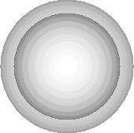
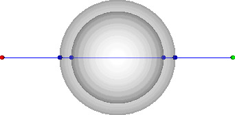
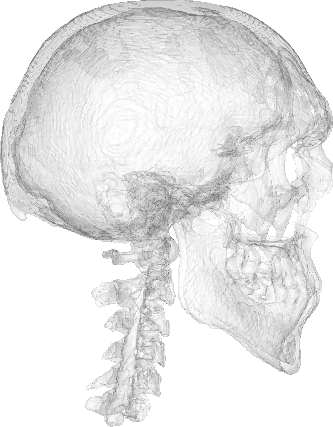
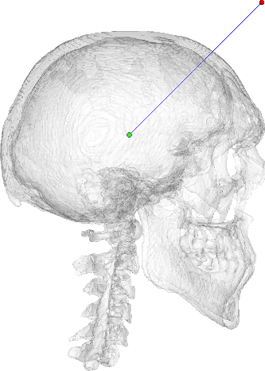

Title: Ray Casting: Intersecting lines/rays with surface meshes using Python and VTK
Author: Adamos Kyriakou
Date: Friday September 15th, 2014
Tags: Python, IPython Notebook, VTK, STL, Ray Tracing, Ray Casting
Categories: Image Processing, Visualization, VTK

In this post I will demonstrate how to use VTK to perform ray-casting, i.e., intersecting lines/rays with surface meshes, and retrieving the coordinates of those intersection points. This will include loading such meshes from STL files, performing the intersections, as well as visualizing the mesh, lines, and points in VTK. In addition, I will present my very own `pycaster` package which cleanly wraps the VTK parts and allows for cleaner code and added functionality.

## Introduction

### Background
Today I'll be talking about [ray-casting](http://en.wikipedia.org/wiki/Ray_casting) which, to quote Wikipedia, is *"the use of ray-surface intersection tests to solve a variety of problems in computer graphics and computational geometry"*. 

A pivotal difference between ray-casting and 'ray-tracing' is that the former only 'casts' a single ray, tests for its intersection with objects, and stops there. Ray-tracing on the other hand is more physically accurate as it integrates physics laws on reflection, refraction, attenuation, etc to 'trace', i.e., follow, that ray and its derivative rays.

However, I should make clear that ray-casting is the natural precursor to ray-tracing as it tells us what part of which object the ray intersects with and provides all necessary information to cast subsequent rays.

### Summary
Today I'll show how to use Python and VTK to perform ray-casting on surface meshes loaded from [STL](http://en.wikipedia.org/wiki/STL_(file_format)) files and the [`vtkOBBTree`](http://www.vtk.org/doc/release/5.2/html/a00908.html) class. 

I will first demonstrate the approach on a very simple model of a hollow sphere which was designed in [Rhino3D](http://www.rhino3d.com/) and exported to STL. Upon establishing the approach, I will talk about my very own [`pycaster` package](https://pypi.python.org/pypi/pycaster) which I wrote to wrap the VTK part of the code, simplify the whole process, and provide some additional functionality. Subsequently, I will repeat the process with `pycaster` on the model of the human skull we extracted and saved as an STL file in the [previous post](http://pyscience.wordpress.com/2014/09/11/surface-extraction-creating-a-mesh-from-pixel-data-using-python-and-vtk/).

## Helper-functions
As I keep writing new posts I will try my darndest to build upon previously presented snippets in the interest of code-reuse, consistency, and brevity. I will be using utilizing those snippets in the form of 'helper-functions' briefly documenting their function and referencing past posts where they were presented in more detail.

The following helper-functions will be used:

- `vtk_show(renderer, width=400, height=300)`: This function allows me to pass a `vtkRenderer` object and get an IPython Notebook compatible image output of that render with given dimensions. This code was presented in this [past post about VTK integration with an IPython Notebook](http://pyscience.wordpress.com/2014/09/03/ipython-notebook-vtk/).
- `addPoint(renderer, p, radius=1.0, color=[0.0, 0.0, 0.0])`: This function allows me to pass the aforementioned `vtkRenderer` object, which 'holds' the entire scene, and to add a 'point' to that scene (prior to its being rendered using `vtk_show`). Upon inspecting the code you will see that we're in fact rendering a sphere with its center coordinates stored within a `list` or `tuple` under the `p` parameter. The sphere's `radius` defaults to `1.0`, while we can also control its `color` which defaults to the RGB value for black. This code was presented in this [past post about VTK integration with an IPython Notebook](http://pyscience.wordpress.com/2014/09/03/ipython-notebook-vtk/), where I showed how to render a red sphere.
- `addLine(renderer, p1, p2, color=[0.0, 0.0, 1.0])`: This function is very similar to `addPoint` but instead adds a line with `p1` and `p2` coordinates using the [`vtkLineSource`](http://www.vtk.org/doc/nightly/html/classvtkLineSource.html) class. Its code is truly similar to `addPoint` so just take a look at this post's [IPython Notebook](http://nbviewer.ipython.org/urls/bitbucket.org/somada141/pyscience/raw/master/20140910_RayCasting/Material/PythonRayCastingSphereVTK.ipynb) and [this past post](http://pyscience.wordpress.com/2014/09/03/ipython-notebook-vtk/) to understand the mechanics.
- `loadSTL(filenameSTL)`: This function uses the [`vtkSTLReader`](http://www.vtk.org/doc/nightly/html/classvtkSTLReader.html) class to load the contents of an `.stl` file under `filenameSTL` and return a [`vtkPolyData`](http://www.vtk.org/doc/nightly/html/classvtkPolyData.html) object containing the mesh. While I've demonstrated how to write an STL file in the [previous post](http://pyscience.wordpress.com/2014/09/11/surface-extraction-creating-a-mesh-from-pixel-data-using-python-and-vtk/), I haven't exactly presented this function so here's its code:

```
def loadSTL(filenameSTL):
    readerSTL = vtk.vtkSTLReader()
    readerSTL.SetFileName(filenameSTL)
    # 'update' the reader i.e. read the .stl file
    readerSTL.Update()

    polydata = readerSTL.GetOutput()

    # If there are no points in 'vtkPolyData' something went wrong
    if polydata.GetNumberOfPoints() == 0:
        raise ValueError(
            "No point data could be loaded from '" + filenameSTL)
        return None
    
    return polydata
```

Similarly to how one writes an STL file (shown in this [previous post](http://pyscience.wordpress.com/2014/09/11/surface-extraction-creating-a-mesh-from-pixel-data-using-python-and-vtk/)), we simply create a new [`vtkSTLReader`](http://www.vtk.org/doc/nightly/html/classvtkSTLReader.html) object, pass the filename of the `.stl` file through the `SetFileName` method, and call `Update` to read in that file. 

The mesh is then stored internally in a [`vtkPolyData`](http://www.vtk.org/doc/nightly/html/classvtkPolyData.html) object, a pointer to which we retrieve through `GetOutput` and store under `polydata` which we eventually return. A point of interest in the above code lies in the usage of the `GetNumberOfPoints` method of the `vtkPolyData` class through which we check if the `vtkSTLReader` object managed to read in anything. As I've said time and time again, VTK is not big on throwing exceptions or giving warnings. Thus, one should always check that the operation was indeed successful.  

## Ray-Casting with Python & VTK
In this example I will show the pure Python+VTK code so you can understand the entire process. You can find the corresponding notebook [here](http://nbviewer.ipython.org/urls/bitbucket.org/somada141/pyscience/raw/master/20140910_RayCasting/Material/PythonRayCastingSphereVTK.ipynb), while the STL model of the hollow-sphere can be download [here](https://bitbucket.org/somada141/pyscience/raw/master/20140910_RayCasting/Material/sphereHollow.stl).

### Loading and rendering the mesh
Initially we load and render the mesh-surface of the hollow sphere using the `loadSTL` and `vtk_show` helper-functions presented prior:

```
mesh = loadSTL("sphereHollow.stl")

mapper = vtk.vtkPolyDataMapper()
mapper.SetInput(mesh)

actor = vtk.vtkActor()
actor.SetMapper(mapper)
actor.GetProperty().SetOpacity(0.25)

renderer = vtk.vtkRenderer()
renderer.AddActor(actor)
renderer.SetBackground(1.0, 1.0, 1.0)
vtk_show(renderer)
```

If you're still having trouble getting this code then do read the [past post about VTK integration with an IPython Notebook](http://pyscience.wordpress.com/2014/09/03/ipython-notebook-vtk/). The only novelty here is the `GetProperty` method of the [`vtkActor`](http://www.vtk.org/doc/nightly/html/classvtkActor.html) class. This method returns a pointer to this actor's [`vtkProperty`](http://www.vtk.org/doc/nightly/html/classvtkProperty.html) object which we can then use to set a whole bunch of visual properties such as the color, visibility of edges, lighting, shading, etc. In this case, we use it to set this actor's 'opacity' through the `SetOpacity` method to `25%` so we can see 'inside' the surface. Lastly, I want to emphasize that the [`vtkRenderer`](http://www.vtk.org/doc/nightly/html/classvtkRenderer.html) is stored under the `renderer` variable to which we'll keep adding actors as we proceed while `mesh` holds a pointer to the [`vtkPolyData`](http://www.vtk.org/doc/nightly/html/classvtkPolyData.html) loaded from the STL file. The above code yields the below figure. 



### Preparing and rendering the ray

This hollow sphere model is centered around `(0,0,0)`, exhibits an outer radius of `25 mm`, and an inner radius of `20 mm`, resulting in a shell thickness of `5 mm`. Therefore, for the purposes of this example, we set the source and target points of the ray to `50 mm` on each side of the the `x` axis as such:

```
pSource = [-50.0, 0.0, 0.0]
pTarget = [50.0, 0.0, 0.0]
```

>Note that there's nothing special about the above 'points'. They're simply two `list` objects with three `float` coordinates each. 

To make the whole thing more visual we use the `addPoint`, and `addLine` helper-functions to add two actors representing the ray's points and an actor representing the line/ray to the `renderer`:

```
addPoint(renderer, pSource, color=[1.0, 0.0, 0.0])
addPoint(renderer, pTarget, color=[0.0, 1.0, 0.0])
addLine(renderer, pSource, pTarget)
vtk_show(renderer)
```

As you can see the 'source' point will be rendered as red, while the 'target' is green. After adding the three actors, we simply use `vtk_show` again and get the following figure.


### Testing for intersection
Now here comes the fun part! At this point we have the surface-mesh under the `mesh` variable and we've configured the ray, defined by the coordinates in `pSource` and `pTarget`, we want to test for intersection with. The heart of this approach, however, lies in the usage of [`vtkOBBTree`](http://www.vtk.org/doc/release/5.2/html/a00908.html) which generates a [oriented bounding-box](http://en.wikipedia.org/wiki/Minimum_bounding_box) 'tree' for the given geometry (the mesh in our case).

Firstly we need to prepare the OBB tree as follows:

```
obbTree = vtk.vtkOBBTree()
obbTree.SetDataSet(mesh)
obbTree.BuildLocator()
```

That's it! We now have a world-class intersection tester at our disposal. We create a new `vtkOBBTree` under `obbTree`, set our `mesh` as its dataset through `SetDataSet`, and call `BuildLocator` which will create the OBB tree, and allows super-fast intersection testing :).

Before we proceed I want you to check the docs for the [`vtkOBBTree`](http://www.vtk.org/doc/release/5.2/html/a00908.html). The method we'll be using is `IntersectWithLine` which as you can see sports 4 overloaded versions. The signature of the one we'll be using is the following:

```
int vtkOBBTree::IntersectWithLine(const double a0[3], const double a1[3], vtkPoints * points, vtkIdList * cellIds)	
```

which provides the following docstring: *"Take the passed line segment and intersect it with the data set. This method assumes that the data set is a vtkPolyData that describes a closed surface, and the intersection points that are returned in 'points' alternate between entrance points and exit points. The return value of the function is 0 if no intersections were found, -1 if point 'a0' lies inside the closed surface, or +1 if point 'a0' lies outside the closed surface. Either 'points' or 'cellIds' can be set to NULL if you don't want to receive that information."*

As in the case of ray-casting we don't care about the cells with which the ray will intersect but do want information on the intersection points, we call the aforementioned method as such:

```
pointsVTKintersection = vtk.vtkPoints()
code = obbTree.IntersectWithLine(pSource, pTarget, pointsVTKintersection, None)
```

As you can see we create a new [`vtkPoints`](http://www.vtk.org/doc/nightly/html/classvtkPoints.html) object, as required by the `IntersectWithLine` signature, which we call `pointsVTKintersection`. We then pass the 'source' and 'target' coordinates of the ray along with 'pointsVTKintersection' where the intersection points will be stored. Lastly, we're using `None` for `cellIds` which will be interpreted as `NULL` as we don't want that information. 

> Notice the `code` variable which stores the return value of `IntersectWithLine`? As you saw in this method's docstring, a particular 'code' is returned depending on the result of the intersection test. It'd be a very good idea to always 'check' that value and ensure that intersection points were indeed found.

### Extracting the intersection point coordinates
At this point we have acquired the intersection points which are stored under `pointsVTKintersection`, an object of [`vtkPoints`](http://www.vtk.org/doc/nightly/html/classvtkPoints.html) type. However, we still need to 'convert' those `vtkPoints` to something that can be manipulated in Python. This next part of the code is important:

```
pointsVTKIntersectionData = pointsVTKintersection.GetData()
noPointsVTKIntersection = pointsVTKIntersectionData.GetNumberOfTuples()
pointsIntersection = []
for idx in range(noPointsVTKIntersection):
    _tup = pointsVTKIntersectionData.GetTuple3(idx)
    pointsIntersection.append(_tup)
```

As you can see, we first need to 'extract' the actual [`vtkDataArray`](http://www.vtk.org/doc/nightly/html/classvtkDataArray.html) from `pointsVTKintersection` using the `GetData` method, which we then assign to `pointsVTKIntersectionData` (lengthy name, I know). We then get the number of intersection points found through `pointsVTKIntersectionData.GetNumberOfTuples()` as every point will be stored as a 3-value tuple of the 3D coordinates. We then create an empty `list` under `pointsIntersection` which will store all those tuples. Subsequently, we loop through those tuples stored in `pointsVTKIntersectionData`, acquiring each of them through the `GetTuple3` method, appending each tuple in the `pointsIntersection` list. A simple `print` shows us those coordinates:

```
[(-24.91461181640625, 0.0, 0.0),
 (-19.914684295654297, 0.0, 0.0),
 (19.914684295654297, 0.0, 0.0),
 (24.91461181640625, 0.0, 0.0)]
```

Finally, using the `addPoint` and `vtk_show` helper functions we loop through these points and render (in blue) them as such:

```
for p in pointsIntersection:
    addPoint(renderer, p, color=[0.0, 0.0, 1.0])
vtk_show(renderer)
```

yielding the figure below.



## Ray-Casting with `pycaster`

### The `pycaster` package

#### Background
I wrote `pycaster` in order to wrap and simplify the VTK functionality you saw above. The `pycaster` package is currently being hosted on PyPI under [this](https://pypi.python.org/pypi/pycaster) link, while the repo can be found on BitBucket under [this](https://bitbucket.org/somada141/pycaster) link. If you're interested, I suggest you take a look at the [BitBucket repo link](https://bitbucket.org/somada141/pycaster) first for instructions.

The `pycaster` package really only has a single module, also called `pycaster`, and contains a single class called `rayCaster` with methods that are simply wrapping the VTK code you saw above. Actually, the VTK code you saw above was pretty much copied from `pycaster`.

#### Installation
If you want to jump straight in then installing `pycaster` is as easy as:

```
pip install pycaster
```

As expected `pycaster` depends on VTK which, if not already installed, might be a hassle to install through `pip`. If you run into trouble with the installation the I suggest you read my [first post on Anaconda](pyscience.wordpress.com/2014/09/01/anaconda-the-creme-de-la-creme-of-python-distros-3/), follow the instructions to create a nice environment, e.g., `py27`, and install `pycaster` as such:

```
source activate py27
conda install vtk
conda install nose
pip install pycaster --no-deps
```

In this example I will show how to use `pycaster` to repeat the above process but this time I'll be doing so on the STL model of the human skull we extracted in the [previous post about surface-extraction](pyscience.wordpress.com/2014/09/11/surface-extraction-creating-a-mesh-from-pixel-data-using-python-and-vtk/). You can find the corresponding notebook [here](http://nbviewer.ipython.org/urls/bitbucket.org/somada141/pyscience/raw/master/20140910_RayCasting/Material/PythonRayCastingSkullPyCaster.ipynb), while the STL model of the skull can be download [here](https://bitbucket.org/somada141/pyscience/raw/master/20140910_RayCasting/Material/bones.stl). I've also repeated the hollow-sphere example we saw above with `pycaster` which you can find in [this](http://nbviewer.ipython.org/urls/bitbucket.org/somada141/pyscience/raw/master/20140910_RayCasting/Material/PythonRayCastingSpherePyCaster.ipynb) notebook.

> The VTK rendering parts of the code we saw before are still the same so I won't be repeating them here. Please check the [notebook for this example](http://nbviewer.ipython.org/urls/bitbucket.org/somada141/pyscience/raw/master/20140910_RayCasting/Material/PythonRayCastingSkullPyCaster.ipynb).

### Loading and rendering the mesh
The `loadSTL` helper-function we used before to... well load the STL, was actually copied from a static method residing under the `rayCaster` class with which we initialize a new `rayCaster` object. Let's see how it's done:

```
from pycaster import pycaster
caster = pycaster.rayCaster.fromSTL("bones.stl", scale=1)
```

As you can see we initially `import` the `pycaster` module `from` the `pycaster` package. Subsequently, we use the `fromSTL` static-method of the `rayCaster` class to immediately load the STL file, ensure that it was loaded correctly, and then create a new `rayCaster` object under the `caster` variable. Note that we can also set a `scale` for that mesh which is particularly useful when we want to 'convert' the mesh units, e.g., from `mm` to `m` etc. If `scale` is set to anything but the default `1.0` the `rayCaster` method `scaleMesh` is called during initialization, scales the mesh, and replaces it internally.

> If you already have a `vtkPolyData` mesh loaded/created in some other way, you can create a `rayCaster` object through the default constructor as such: `caster = pycaster.rayCaster(mesh)` where `mesh` is a `vtkPolyData` object. If you then want to 'scale' that mesh as was done above, you can use the `scaleMesh` method and do so as such: `caster.scaleMesh(scale)`.

Using the same VTK code to render the `mesh`, which now resides under `caster.mesh`, we get the next figure.



> You might notice that the skull rendered above displays a much cleaner surface than what we extracted in the ['Surface Extraction: Creating a mesh from pixel-data using Python and VTK'](http://pyscience.wordpress.com/2014/09/11/surface-extraction-creating-a-mesh-from-pixel-data-using-python-and-vtk/) post. Well, to be honest I cheated a tad and edited the model through [Rhino3D](http://www.rhino3d.com/) and [Geomagic Studio](http://www.geomagic.com/en/products/studio/overview/). I did so to place the model around the cartesian origin point, thus eliminating the need to reposition the scene camera, to get rid of all those disjoint meshes, and to clean spikes and holes.

### Preparing and rendering the ray
The 'preparation' of the ray is exactly the same as in the case of the pure-VTK code. We simply create two `list` objects with the coordinates which in this case are:

```
pSource = [100.0, 100.0, 0.0]
pTarget = [0.0, 0.0, 0.0]
```

We then use the same VTK code as before to render that ray (prior to the actual intersection) resulting in the following figure.



### Testing for intersection and extracting the intersection point coordinates
Now here comes why I bothered writing `pycaster`. As you saw in the VTK example before, at this point we would need to create and initialize the `vtkOBBTree`, create empty `vtkPoints` objects, test for intersection, and then convert the coordinates to `tuple` objects. However, with `pycaster` the whole process is much simpler.

Using the `pSource` and `pTarget` coordinates we set before, we test for intersection and retrieve the point coordinates using the `castRay` method of the `rayCaster` class as such:

```
pointsIntersection = caster.castRay(pSource, pTarget)
```

which returns a `list` of `tuple` under `pointsIntersection`. As you can see we saved ourselves a bunch of code and got a clean pythonic object which we can easily `print` and get:

```
[(62.1171, 62.1171, 0.0000), (56.1171, 56.1171, 0.0000)]
```

> Note that the `castRay` method will return an empty `list` if no intersection points were found and give an `info` message through the `logging` package.

Using the same VTK rendering approach to display the intersection points as last time we get the following figure.


### The `calcDistanceInSolid` method
I should mention another method within the `rayCaster` class which IMHO is very useful. The method is called `calcDistanceInSolid` and its called in the same way as `castRay`, i.e., by providing the ray coordinates.

What this method does is calculate the distance a given ray 'travels' within the closed surface, i.e., the solid. While that sounds simple its actually rather complicated as VTK only provides a list of intersection points without specifying whether they're entry or exit points. Combined with the fact that the 'source' and/or 'target' of a ray may already reside within the surface, this calculation becomes rather convoluted.

Calling this method in the case of the skull mesh as `caster.calcDistanceInSolid(pSource, pTarget)` gives us a distance of ca. `8.485` which you can verify by calculating the euclidian distance between the two intersection points we saw before.

> The `calcDistanceInSolid` method calculates the **total** distance 'travelled' by a ray and will take into account all intersection points found, i.e., multiple entries and exits. In addition, it will account for the the 'source' and 'target' points of the ray regardless of whether they were within the surface to begin with or not.

---

## Links & Resources
As my posts are becoming ludicrously long, I decided to start re-listing the links to the various material here so you won't have to go through the whole post to find them:

### Material
Here's the material used in this post:

- Hollow-sphere example with VTK: [IPython Notebook](http://nbviewer.ipython.org/urls/bitbucket.org/somada141/pyscience/raw/master/20140910_RayCasting/Material/PythonRayCastingSphereVTK.ipynb) and [STL file](https://bitbucket.org/somada141/pyscience/raw/master/20140910_RayCasting/Material/sphereHollow.stl).
- Hollow-sphere example with `pycaster`: [IPython Notebook](http://nbviewer.ipython.org/urls/bitbucket.org/somada141/pyscience/raw/master/20140910_RayCasting/Material/PythonRayCastingSpherePyCaster.ipynb) and [STL file](https://bitbucket.org/somada141/pyscience/raw/master/20140910_RayCasting/Material/sphereHollow.stl).
- Human-skull example with `pycaster`: [IPython Notebook](http://nbviewer.ipython.org/urls/bitbucket.org/somada141/pyscience/raw/master/20140910_RayCasting/Material/PythonRayCastingSkullPyCaster.ipynb) and [STL file](https://bitbucket.org/somada141/pyscience/raw/master/20140910_RayCasting/Material/bones.stl).

### `pycaster`
Here are the pages where you can find the `pycaster` package:

- PyPI page: [https://pypi.python.org/pypi/pycaster](https://pypi.python.org/pypi/pycaster)
- BitBucket repo: [https://bitbucket.org/somada141/pycaster](https://bitbucket.org/somada141/pycaster)

### See also
Check these past posts which were used and referenced today:

- [Anaconda: The crème de la crème of Python distros](http://pyscience.wordpress.com/2014/09/01/anaconda-the-creme-de-la-creme-of-python-distros-3/)
- [IPython Notebook & VTK](http://pyscience.wordpress.com/2014/09/03/ipython-notebook-vtk/)
- [Surface Extraction: Creating a mesh from pixel-data using Python and VTK](http://pyscience.wordpress.com/2014/09/11/surface-extraction-creating-a-mesh-from-pixel-data-using-python-and-vtk/)

> Don't forget: all material I'm presenting in this blog can be found under the [PyScience BitBucket repository](https://bitbucket.org/somada141/pyscience).

---

Thus concludes another humble post. I hope you enjoyed the whole ray-casting experience as it can be the cornerstone to a **lot** of super-interesting ray-tracing projects. Off the top of my head you can write code for ray-tracing renderers, ray-tracing physics simulations in optics and acoustics, while ray-casting and ray-tracing is heavily used in game-development (collision detection, rendering, etc).

The material presented here has been tested extensively so you shouldn't have any trouble reproducing the whole thing. However, if you do then feel free to drop me a comment here and I'll try to help.

Thanks for reading!