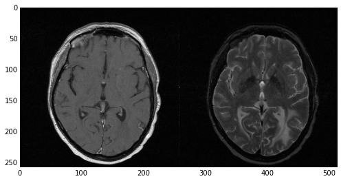
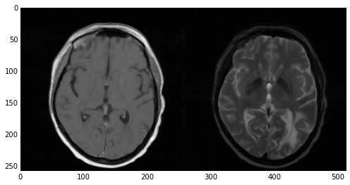
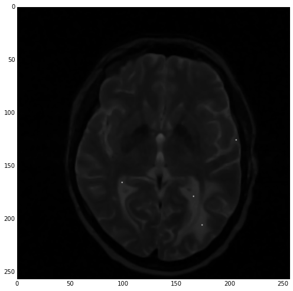
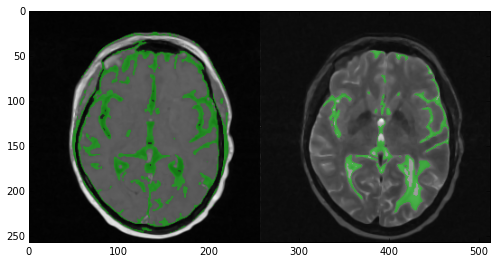
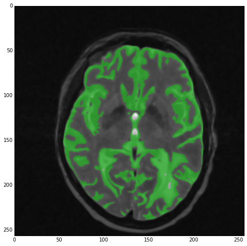
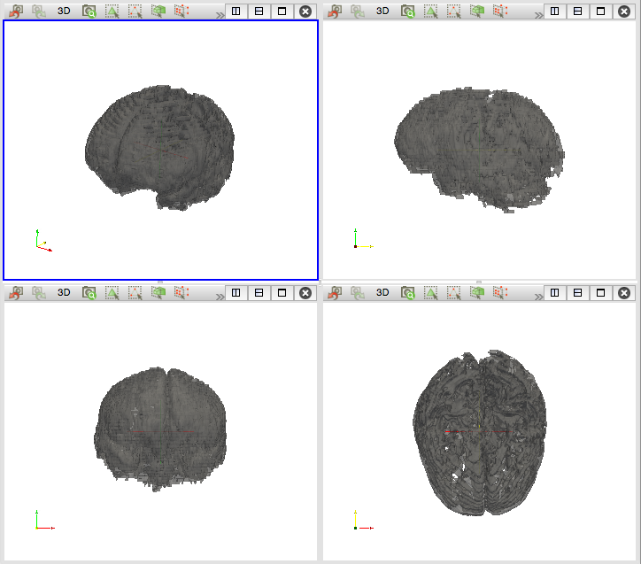

Title: Multi-Modal Image Segmentation with Python & SimpleITK
Author: Adamos Kyriakou
Date: Friday October 16th, 2014
Tags: Python, IPython Notebook, DICOM, ITK, SimpleITK, Medical Image Processing, Image Segmentation
Categories: Image Processing, Visualization, ITK/SimpleITK, Image Segmentation, IO

In this post I will show how to use SimpleITK to perform multi-modal segmentation on a T1 and T2 MRI dataset for better accuracy and performance. The tutorial will include  input and output of MHD images, visualization tricks, as well as uni-modal and multi-modal segmentation of the datasets.

<!--more-->

---

# Introduction

## Background
In the [previous post](http://pyscience.wordpress.com/2014/10/19/image-segmentation-with-python-and-simpleitk/), I introduced [SimpleITK](http://www.simpleitk.org/), a simplified layer/wrapper build on top of [ITK](http://www.itk.org/), allowing for advanced image processing including but not limited to image segmentation, registration, and interpolation.

The primary strengths of SimpleITK, links and material, as well as its installation -- for vanilla and alternative Python distributions -- was extensively discussed in the last post entitled ['Image Segmentation with Python and SimpleITK'](http://pyscience.wordpress.com/2014/10/19/image-segmentation-with-python-and-simpleitk/). If you haven't read that post I recommend that you do so before proceeding with this one as I will not be re-visiting these topics.

### Multi-Modal Segmentation
Typically, when performing segmentations of medical image data we use a single dataset acquired through a single imaging modality, e.g., MRI, CT, PET, etc. However, different imaging modalities give us very different images of the same anatomy. 

For example, a [computed tomography (CT)](http://en.wikipedia.org/wiki/X-ray_computed_tomography) dataset would provide a very clear depiction of bone structures in the human body. On the other hand, magnetic resonance (MR) images provide excellent contrast in soft-tissue, e.g., muscle, brain matter, etc, anatomies barely visible with CT. In addition, differently weighted images and different contrast agents depict the same anatomies with different intensities. Such a case is the gray matter which appears darker than white matter in T1-weighted images but considerably brighter than white matter in T2-weighted images.


### The Dataset: The RIRE Project
[Today's dataset](https://bitbucket.org/somada141/pyscience/raw/master/20141016_MultiModalSegmentation/Material/patient_109.zip) is taken from the [Retrospective Image Registration Evaluation (RIRE) Project](http://www.insight-journal.org/rire/index.php), which was *"designed to compare retrospective CT-MR and PET-MR registration techniques used by a number of groups"*. 

The [RIRE Project](http://www.insight-journal.org/rire/index.php) provides [patient datasets](http://www.insight-journal.org/rire/download_data.php) acquired with different imaging modalities, e.g., MR, CT, PET, which are meant to be used in evaluation of different image registration and segmentation techniques. The datasets are distributed in a zipped [MetaImage (`.mhd`) format](http://www.itk.org/Wiki/MetaIO/Documentation) with a [Creative Commons Attribution 3.0 United States license](http://creativecommons.org/licenses/by/3.0/us/legalcode) which pretty much [translates to](http://creativecommons.org/licenses/by/3.0/us/) "you can do whatever you want with this". Thus, these datasets are perfect for my tutorials :).

In particular, [today's dataset](https://bitbucket.org/somada141/pyscience/raw/master/20141016_MultiModalSegmentation/Material/patient_109.zip) is a reduced, and slightly modified, version of the 'patient_109' dataset which can be downloaded [here](http://www.insight-journal.org/rire/download_data.php). Just [download my version](https://bitbucket.org/somada141/pyscience/raw/master/20141016_MultiModalSegmentation/Material/patient_109.zip) and extract its contents alongside [today's notebook](http://nbviewer.ipython.org/urls/bitbucket.org/somada141/pyscience/raw/master/20141016_MultiModalSegmentation/Material/MultiModalSegmentation.ipynb). The resulting directory structure should look something like this:

```
|____MultiModalSegmentation.ipynb
|____patient_109
| |____mr_T1
| | |____header.ascii
| | |____image.bin
| | |____patient_109_mr_T1.mhd
| |____mr_T2
| | |____header.ascii
| | |____image.bin
| | |____patient_109_mr_T2.mhd
|____patient_109.zip
```

As you can see from the above directory structure, [today's dataset](https://bitbucket.org/somada141/pyscience/raw/master/20141016_MultiModalSegmentation/Material/patient_109.zip) comprises two [MetaImage (`.mhd`)](http://www.itk.org/Wiki/MetaIO/Documentation) files with a T1 and T2 MRI datasets of a single patient. In case you didn't know, the [MHD format](http://www.itk.org/Wiki/MetaIO/Documentation) is a very simple format employed heavily in the distribution of medical image data. In a nutshell its just a ASCII header, with an `.mhd` extension, which defines basic image properties, e.g., dimensions, spacing, origin, which is used to read an accompanying raw binary file, typically with a `.raw` or `.bin` extension, with the actual image data. [MHD](http://www.itk.org/Wiki/MetaIO/Documentation) files are very commonplace and supported by libraries like [VTK](http://www.vtk.org/) and [ITK](http://itk.org/), visualization software like [MayaVi](http://code.enthought.com/projects/mayavi/), [ParaView](http://www.paraview.org/), and [VisIt](https://wci.llnl.gov/simulation/computer-codes/visit), as well as image processing software like [3DSlicer](http://www.slicer.org/) and [MeVisLab](http://www.mevislab.de/).

## Summary

In today's post I'll start by showing you the advantages of multi-modal segmentation over segmentation performed on uni-modal images. I start by with the segmentation of the gray matter in the T1 and T2 image datasets of a single patient.

---

# Multi-Modal Segmentation

## Imports
Let's start with the imports

```
import os
import numpy
import SimpleITK
import matplotlib.pyplot as plt
%pylab inline
```

Once more, if you don't have a working installation of [SimpleITK](http://www.simpleitk.org/), check the [previous post](http://pyscience.wordpress.com/2014/10/19/image-segmentation-with-python-and-simpleitk/) where the topic is extensively discussed. In addition, if you don't happen to have [VTK](http://www.vtk.org/) then I suggest checking [this early post](http://pyscience.wordpress.com/2014/09/01/anaconda-the-creme-de-la-creme-of-python-distros-3/) and going for [Anaconda Python](https://store.continuum.io/cshop/anaconda/).

> Note: it might take a lil' while to import all these libraries. `SimpleITK` and `vtk` in particular are huge and rather heavy so don't freak out if it takes half a minute for the imports to go through.

## Helper-Functions
The following 'helper-functions' are defined at the beginning of [today's notebook](http://nbviewer.ipython.org/urls/bitbucket.org/somada141/pyscience/raw/master/20141016_MultiModalSegmentation/Material/MultiModalSegmentation.ipynb) and used throughout:

- `sitk_show(img, title=None, margin=0.0, dpi=40)`: This function uses `matplotlib.pyplot` to quickly visualize a 2D `SimpleITK.Image` object under the `img` parameter by first converting it to a `numpy.ndarray`. It was first introduced in [this past post about SimpleITK](http://pyscience.wordpress.com/2014/10/19/image-segmentation-with-python-and-simpleitk/).

## Options
Near the beginning of [today's notebook](http://nbviewer.ipython.org/urls/bitbucket.org/somada141/pyscience/raw/master/20141016_MultiModalSegmentation/Material/MultiModalSegmentation.ipynb) the we'll define a few options to keep the rest of the notebook 'clean' and allow you to make direct changes without perusing/amending the entire notebook.

```
# Paths to the .mhd files
filenameT1 = "./patient_109/mr_T1/patient_109_mr_T1.mhd"
filenameT2 = "./patient_109/mr_T2/patient_109_mr_T2.mhd"

# Slice index to visualize with 'sitk_show'
idxSlice = 26

# int label to assign to the segmented gray matter
labelGrayMatter = 1
```

As you can see the first options,  `filenameT1` and `filenameT2`, relate to the location of the accompanying `.mhd` files. Again, you need to extract the contents of [today's dataset](https://bitbucket.org/somada141/pyscience/raw/master/20141016_MultiModalSegmentation/Material/patient_109.zip) next to [today's notebook](http://nbviewer.ipython.org/urls/bitbucket.org/somada141/pyscience/raw/master/20141016_MultiModalSegmentation/Material/MultiModalSegmentation.ipynb).

Unlike in the previous post, where segmentation was performed in 2D, today's post will be performing a full 3D segmentation of the entire dataset. However, as we'll be using the `sitk_show` helper-function to display the results of the segmentation, the `idxSlice` options gives us the index of the slice which we will be visualizing.

Lastly, `labelGrayMatter` is merely an integer value which will act as a label index for the gray matter in the segmentation.

## Image-Data Input
We'll start by reading the image data using SimpleITK. Since MHD images are inherently supported by ITK/SimpleIKT, reading them is as simple as this:

```
imgT1Original = SimpleITK.ReadImage(filenameT1)
imgT2Original = SimpleITK.ReadImage(filenameT2)
```

> Remember: `filenameT1` and `filenameT2` were defined under the *Options*.

Next we'll visualize these two datasets at the slice defined by `idxSlice` using the `sitk_show` helper-function. However, let's spruce it up a bit and tile the two images using the direct call to the [`TileImageFilter` class](http://www.itk.org/SimpleITKDoxygen/html/classitk_1_1simple_1_1TileImageFilter.html):

```
sitk_show(SimpleITK.Tile(imgT1Original[:, :, idxSlice],
                         imgT2Original[:, :, idxSlice],
                         (2, 1, 0)))
```

The [`TileImageFilter` class](http://www.itk.org/SimpleITKDoxygen/html/classitk_1_1simple_1_1TileImageFilter.html) *"tiles multiple input images into a single output image using a user-specified layout"*. Essentially, you pass a series of `SimpleITK.Image` objects, either as separate function arguments or within a `list`, and you get a tiles output image with the layout defined through a `tuple`. The result of `sitk_show` is shown below:



> As you can see I'll be using direct calls to the class wrappers defined for the different filters in SimpleITK. The different between direct calls and the filter 'construction-initialization-execution' paradigm offered by SimpleITK was extensively discussed in [this previous post](http://pyscience.wordpress.com/2014/10/19/image-segmentation-with-python-and-simpleitk/).

## Image Smoothing/Denoising
As discussed in the [previous post](http://pyscience.wordpress.com/2014/10/19/image-segmentation-with-python-and-simpleitk/), prior to segmentation of medical image data we need to apply some smoothing/denoising to make the pixel distribution more uniform, thus facilitating region-growing algorithms. 

We do so through the [`CurvatureFlowImageFilter`](http://www.itk.org/SimpleITKDoxygen/html/classitk_1_1simple_1_1CurvatureFlowImageFilter.html#details) class. Check the [previous post](http://pyscience.wordpress.com/2014/10/19/image-segmentation-with-python-and-simpleitk/) for more details.

```
imgT1Smooth = SimpleITK.CurvatureFlow(image1=imgT1Original,
                                      timeStep=0.125,
                                      numberOfIterations=5)

imgT2Smooth = SimpleITK.CurvatureFlow(image1=imgT2Original,
                                      timeStep=0.125,
                                      numberOfIterations=5)

sitk_show(SimpleITK.Tile(imgT1Smooth[:, :, idxSlice], 
                         imgT2Smooth[:, :, idxSlice], 
                         (2, 1, 0)))
```

Note that the smoothened images now reside under `imgT1Smooth` and `imgT2Smooth` respectively. Once more, using [`TileImageFilter` class](http://www.itk.org/SimpleITKDoxygen/html/classitk_1_1simple_1_1TileImageFilter.html) and the `sitk_show` helper-function we get the next figure.



## Seed Definition
Next, we need to define a series of 'seeds', i.e., points in the image data where we want the region-growing segmentation algorithms to start from. Again, these things were explained in the [previous post](http://pyscience.wordpress.com/2014/10/19/image-segmentation-with-python-and-simpleitk/). Here's the code:

```
lstSeeds = [(165, 178, idxSlice),
            (98, 165, idxSlice),
            (205, 125, idxSlice),
            (173, 205, idxSlice)]

imgSeeds = SimpleITK.Image(imgT2Smooth)

for s in lstSeeds:
    imgSeeds[s] = 10000

sitk_show(imgSeeds[:, :, idxSlice])
```

Note that we only defined seed points on the slice defined by `idxSlice` so we can easily visualize them. What's interesting here is the way we're creating a 'dummy' image, i.e. `imgSeeds` by using the `SimpleITK.Image` constructor and the `imgT2Smooth` image. What this operation does is essentially deep-copy `imgT2Smooth` into `imgSeeds` allowing us to ruin the latter without affecting the former. We then loop through the seeds defined in `lstSeeds` and set those pixels to a high value so they will stand out and allow us to see them through `sitk_show`. The resulting image is the following:



As explained in the [previous post about SimpleITK](http://pyscience.wordpress.com/2014/10/19/image-segmentation-with-python-and-simpleitk/), the index order in SimpleITK is the reverse from that in NumPy so the seeds defined under `lstSeeds`.???

## Auxiliary Function: Vector-Image Tiling
Before I go on with the segmentation, I want to draw your attention to the following. Those who read the [previous post on SimpleITK](http://pyscience.wordpress.com/2014/10/19/image-segmentation-with-python-and-simpleitk/) might remember that we used the [`TileImageFilter` class](http://www.itk.org/SimpleITKDoxygen/html/classitk_1_1simple_1_1TileImageFilter.html) to create overlays of the medical image and the segmented label, giving us a good idea of how (un)successful the segmentation was.

However, if we wanted to tile two overlays of the two T1 and T2 segmented images that's when we run into trouble. The [`TileImageFilter` class](http://www.itk.org/SimpleITKDoxygen/html/classitk_1_1simple_1_1TileImageFilter.html)  only works on single-components images, i.e., images with one value per pixel. Thus, we can't directly tile RGB images or, in our case, images with a label-overlay as we were doing in the [previous post](http://pyscience.wordpress.com/2014/10/19/image-segmentation-with-python-and-simpleitk/).

What we can do, however, is extract the matching components from each multi-component image, tile them, and then compose the different single-component images into a multi-component one. This is exactly what the `sitk_tile_vec` auxiliary function we're defining next does:

```
def sitk_tile_vec(lstImgs):
    lstImgToCompose = []
    for idxComp in range(lstImgs[0].GetNumberOfComponentsPerPixel()):
        lstImgToTile = []
        for img in lstImgs:
            lstImgToTile.append(SimpleITK.VectorIndexSelectionCast(img, idxComp))
        lstImgToCompose.append(SimpleITK.Tile(lstImgToTile, (len(lstImgs), 1, 0)))
    sitk_show(SimpleITK.Compose(lstImgToCompose))
```

This auxiliary function takes a list of multi-component images, which in our case is going to be a list of images where we overlay the segmented label, tiles them, and uses the `sitk_show` helper-function to display the result. Using the `GetNumberOfComponentsPerPixel` method of the `SimpleITK.Image` class we loop through the different components in each image. 

We then loop through all images in `lstImgs` and use the [`VectorIndexSelectionCastImageFilter`](http://www.itk.org/SimpleITKDoxygen/html/classitk_1_1simple_1_1VectorIndexSelectionCastImageFilter.html) to extract a single-component image which we append to `lstImgToTile`. We then tile all the single-component images and append to `lstImgToCompose` for the eventual composition.

Finally, we use the [`ComposeImageFilter`](http://www.itk.org/SimpleITKDoxygen/html/classitk_1_1simple_1_1ComposeImageFilter.html), to create a single multi-component image of the tiled single-component images which we finally display with `sitk_show`

## Uni-Modal Segmentation
We'll first start by applying the region-growing algorithm to each of the two image, namely `imgT1Smooth` and `imgT2Smooth` so we can see the advantages offered by multi-modal segmentation later on.

We're doing so using the [`ConfidenceConnectedImageFilter`](http://www.itk.org/SimpleITKDoxygen/html/classitk_1_1simple_1_1ConfidenceConnectedImageFilter.html) class. I suggest you take a look at the docstring for that class to see what it does but in a nutshell *"this filter extracts a connected set of pixels whose pixel intensities are consistent with the pixel statistics of a seed point"*. Its really all based on a confidence interval based on the `multiplier` parameter and the calculated standard deviation in a pixel-neighborhood. Here's the code:

```
imgGrayMatterT1 = SimpleITK.ConfidenceConnected(image1=imgT1Smooth, 
                                                seedList=lstSeeds,
                                                numberOfIterations=3,
                                                multiplier=1,
                                                replaceValue=labelGrayMatter)

imgGrayMatterT2 = SimpleITK.ConfidenceConnected(image1=imgT2Smooth, 
                                                seedList=lstSeeds,
                                                numberOfIterations=3,
                                                multiplier=1,
                                                replaceValue=labelGrayMatter)

imgT1SmoothInt = SimpleITK.Cast(SimpleITK.RescaleIntensity(imgT1Smooth), 
                                imgGrayMatterT1.GetPixelID())
imgT2SmoothInt = SimpleITK.Cast(SimpleITK.RescaleIntensity(imgT2Smooth), 
                                imgGrayMatterT2.GetPixelID())

sitk_tile_vec([SimpleITK.LabelOverlay(imgT1SmoothInt[:,:,idxSlice], 
                                      imgGrayMatterT1[:,:,idxSlice]),
               SimpleITK.LabelOverlay(imgT2SmoothInt[:,:,idxSlice], 
                                     imgGrayMatterT2[:,:,idxSlice])])
```

Note that much like what was done in the [previous post](http://pyscience.wordpress.com/2014/10/19/image-segmentation-with-python-and-simpleitk/), we create two rescaled integer version of `imgT1Smooth` and `imgT2Smooth` named `imgT1SmoothInt` and `imgT2SmoothInt` respectively. We do so in order to create label overlays using the ['LabelOverlayImageFilter'](http://www.itk.org/SimpleITKDoxygen/html/classitk_1_1simple_1_1LabelOverlayImageFilter.html). 

Also, note that we're using the auxiliary function `sitk_tile_vec` we defined previously to tile these label overlays. The result of `sitk_tile_vec` is shown below.



Now take a look at the results of the segmentation. In the T1 image (left) the algorithm did quite a good job covering the majority of the gray matter. However, multiple areas of the skin and fat were also included. In the case of the T2 image (right) the results were nowhere near as good. Multiple areas of gray matter were not segmented despite the large number of iterations. You can experiment with the `numberOfIterations` and `multiplier` parameters if you want but chances are you'll end up segmenting the entire head. Alternatively you can apply more stringent criteria and up the number of seed points. However, here's where multi-modal segmentation comes into play.

## Multi-Modal Segmentation
As discussed, multi-modal segmentation gives us multiple views of the same anatomies. In our case by combining the T1 and T2 images we get two significantly different views of the gray matter and areas that were not connected in one of the images may be connected in the other. In addition, specious connections appearing in one image due to excessive noise or artifacts will most likely not appear in the other. 

This allows us to perform the segmentation having more information in our arsenal and achieving the same or better results with more stringent criteria and far fewer iterations. Let's see the code:

```
imgComp = SimpleITK.Compose(imgT1Smooth, imgT2Smooth)

imgGrayMatterComp = SimpleITK.VectorConfidenceConnected(image1=imgComp, 
                                               seedList=lstSeeds,
                                               numberOfIterations=1,
                                               multiplier=0.1,
                                               replaceValue=labelGrayMatter)

sitk_show(SimpleITK.LabelOverlay(imgT2SmoothInt[:,:,idxSlice], 
                                 imgGrayMatterComp[:,:,idxSlice]))
```

Firstly, we begin by 'combining' the two images. In order to do that we simply use the [`ComposeImageFilter`](http://www.itk.org/SimpleITKDoxygen/html/classitk_1_1simple_1_1ComposeImageFilter.html) which we also used in the `sitk_tile_vec` auxiliary function. Through that filter we create a single multi-component image containing the information of both T1 and T2 images. The result of the composition is the `imgComp` image.

Then all we need to do is perform the segmentation. However, as you see in the above code, we don't just use the [`ConfidenceConnectedImageFilter`](http://www.itk.org/SimpleITKDoxygen/html/classitk_1_1simple_1_1ConfidenceConnectedImageFilter.html) class but rather the [`VectorConfidenceConnectedImageFilter`](http://www.itk.org/SimpleITKDoxygen/html/classitk_1_1simple_1_1VectorConfidenceConnectedImageFilter.html) class. The mechanics are exactly the same with the pivotal difference being that [`VectorConfidenceConnectedImageFilter`](http://www.itk.org/SimpleITKDoxygen/html/classitk_1_1simple_1_1VectorConfidenceConnectedImageFilter.html) performs the operation on a vector image, i.e., an image with multiple components per pixel (as is our case).

Note that we're using the same seeds but much more stringent criteria, i.e., low `multiplier` value, and only `1` iteration! The result can be seen below:



As you can see, the results are quite great. Not only did we get rid of the skin and fat parts that segmentation on the T1 image gave us, but we also segmented pretty much all gray matter! Of course the segmentation is not perfect as multiple areas of white matter are also segmented but given our lazy approach they're pretty decent.

Finally, we can store the results of our segmentation as a separate `.mhd` file containing only the gray matter label. As we saw when loading the input `.mhd` files, SimpleITK makes these type of operation ridiculously easy. In order to save `imgGrayMatterComp` under the filename `GrayMatter.mhd` all we need to do is the following:

```
SimpleITK.WriteImage(imgGrayMatterComp, "GrayMatter.mhd")
```

Now we can open this file with any of the software supporting the MHD format. In our case I opened it in [ParaView](http://www.paraview.org/) and used the built-in `Contour` filter to get a 3D iso-surface of our segmentation which you can see in the next figure. 

