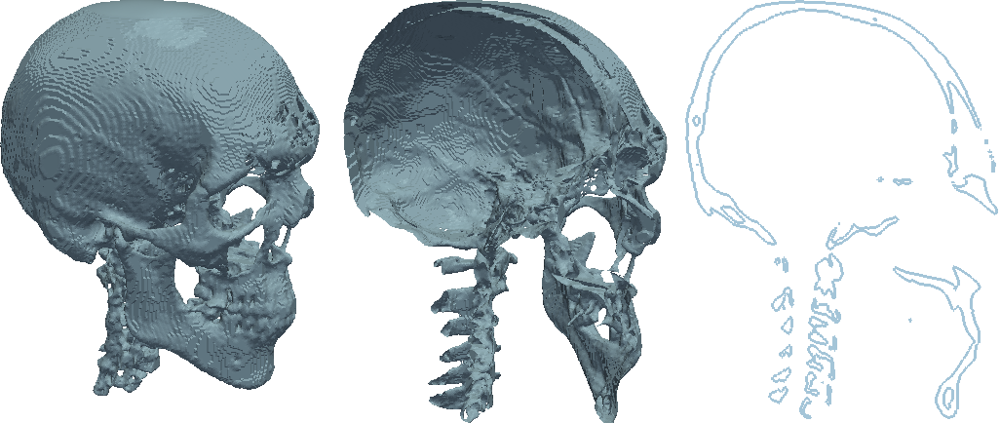

Title: Volume Rendering with Python and VTK
Author: Adamos Kyriakou
Date: Friday October 29th, 2014
Tags: Python, IPython Notebook, VTK, Medical Image Processing, Volume Rendering
Categories: Image Processing, Visualization, IO, VTK


<!--more-->

---

# Introduction

## Background
Some of you might have read my [previous post about surface extraction](http://pyscience.wordpress.com/2014/09/11/surface-extraction-creating-a-mesh-from-pixel-data-using-python-and-vtk/). Well in that post we performed an automatic segmentation of the bone-structures in a CT dataset and extracted a 3D surface depicting those structures. You might remember that same skull model that was used later in my [previous post about ray-casting](http://pyscience.wordpress.com/2014/09/21/ray-casting-with-python-and-vtk-intersecting-linesrays-with-surface-meshes/).

Well the 'problem' with those surface models is that they're exactly that, surfaces! Essentially they're 2D surfaces arranged in a 3D space but they're entirely hollow. Take a look at the figure below:



As you can see, what we've got here is two surfaces defining a 'pseudo-volume' but there's nothing in them which becomes obvious when we clip/slice through them. The clipping and slicing in the above figure was performed in [ParaView](http://www.paraview.org/) using the [STL model of the skull](https://bitbucket.org/somada141/pyscience/raw/master/20140910_RayCasting/Material/bones.stl) which was used in the [previous post about ray-casting](http://pyscience.wordpress.com/2014/09/21/ray-casting-with-python-and-vtk-intersecting-linesrays-with-surface-meshes/).

However, it is often the case that we want to visualize the entirety of a 3D volume, i.e., all the data that lies beneath the surface (yes, that was another one of my puns). Well, in that case we need to resort to a technique aptly termed ['volume rendering'](http://en.wikipedia.org/wiki/Volume_rendering).

Per the [VTK User's Guide](http://www.kitware.com/products/books/vtkguide.html),  "volume rendering is a term used to describe a rendering process applied to 3D data where information exists throughout a 3D space instead of simply on 2D surfaces defined in 3D space". Now, volume rendering is a inordinately popular topic in graphics and visualization. As a result, its one of the few topics in VTK that's surprisingly well documented. Due to its popularity its also one of the actively developed areas in VTK and the material I'll be presented may well be outdated a year from now (check out this [post on VTK volume rendering updates](http://www.kitware.com/source/home/post/154) on the Kitware blog). Should you want to learn more about volume rendering, and there's lots to learn, I've arrayed a number of resource links at the end of this post.

### The Dataset: Brain Atlas
[Today's dataset](https://bitbucket.org/somada141/pyscience/raw/master/20141029_VolumeRendering/Material/nac_brain_atlas.zip) comes from a project entitled ['Multi-modality MRI-based Atlas of the Brain'](http://www.spl.harvard.edu/publications/item/view/2037) by Halle et al. and it is currently available in the [Publication Database hosted by Harvard's Surgical Planning Laboratory (SPL)](https://www.spl.harvard.edu/publications/pages/display/?entriesPerPage=50&collection=1). In a nutshell, this project provides us with a very nicely segmented labelfield of the human brain with something like 150 distinguishable brain structures, along with the original medical image data.

What I did was download [this](https://www.spl.harvard.edu/publications/bitstream/download/5276) version of the atlas, which I then modified and boiled down to a compressed `.mha` file using [3DSlicer](http://www.slicer.org/). Unlike the [MHD format](http://www.itk.org/Wiki/MetaIO/Documentation), which was discussed in the [previous post about multi-modal segmentation](http://pyscience.wordpress.com/2014/11/02/multi-modal-image-segmentation-with-python-simpleitk/), this `.mha` file contains both the header and binary image data within the same file. In addition, I modified the accompanying color-file, which is essentially a [CSV file](http://en.wikipedia.org/wiki/Comma-separated_values) listing every index in the labelfield along with the name of the represented brain structure and a suggested RGB color.

What you need to do is download [today's dataset](https://bitbucket.org/somada141/pyscience/raw/master/20141029_VolumeRendering/Material/nac_brain_atlas.zip), and extract the contents of the `.zip` file alongside [today's notebook](http://nbviewer.ipython.org/urls/bitbucket.org/somada141/pyscience/raw/master/20141029_VolumeRendering/Material/VolumeRendering.ipynb).

## Summary

---

# Volume Rendering with Python and VTK

## Imports
As always, we'll be starting with the imports:

```
import os
import numpy
import vtk
```

I know I've said in pretty much every post pertaining to VTK but if you don't have a working installation of Python with VTK then do yourselves a favor and use [Anaconda Python](https://store.continuum.io/cshop/anaconda/) (check [this early post](http://pyscience.wordpress.com/2014/09/01/anaconda-the-creme-de-la-creme-of-python-distros-3/) on it).

## Helper-Functions
The following 'helper-functions' are defined at the beginning of [today's notebook](http://nbviewer.ipython.org/urls/bitbucket.org/somada141/pyscience/raw/master/20141029_VolumeRendering/Material/VolumeRendering.ipynb) and used throughout:

- `vtk_show(renderer, width=400, height=300)`: This function allows me to pass a [`vtkRenderer`](http://www.vtk.org/doc/nightly/html/classvtkRenderer.html) object and get a PNG image output of that render, compatible with the IPython Notebook cell output. This code was presented in [this past post about VTK integration with an IPython Notebook](http://pyscience.wordpress.com/2014/09/03/ipython-notebook-vtk/).
- `createDummyRenderer()`: A very simple function that just creates a `vtkRenderer` object and sets some basic properties, applicable only to this post's rendering purposes. As we'll be rendering several different scenes I thought it'd be simpler to just create a new renderer/scene for every case rather than removing/adding actors all the time, thus making each rendering independent from its preceding ones.
- `l2n = lambda l: numpy.array(l)` and `n2l = lambda n: list(n)`: Two simple `lambda` functions meant to quickly convert a `list` or `tuple` to a `numpy.ndarray` and vice-versa. These function were first used in [this past post about ray-tracing with VTK](http://pyscience.wordpress.com/2014/10/05/from-ray-casting-to-ray-tracing-with-python-and-vtk/).

## Options
Near the beginning of [today's notebook](http://nbviewer.ipython.org/urls/bitbucket.org/somada141/pyscience/raw/master/20141029_VolumeRendering/Material/VolumeRendering.ipynb) we'll define a few options to keep the rest of the notebook 'clean' and allow you to make direct changes without perusing/amending the entire notebook.

```
# Path to the .mha file
filenameSegmentation = "./nac_brain_atlas/brain_segmentation.mha"

# Path to colorfile.txt 
filenameColorfile = "./nac_brain_atlas/colorfile.txt"

# Opacity of the different volumes (between 0.0 and 1.0)
volOpacityDef = 0.25
```

The two options `filenameSegmentation` and `filenameColorfile` simply show the location of the `.mha` file and the 'colorfile' in [today's dataset](https://bitbucket.org/somada141/pyscience/raw/master/20141029_VolumeRendering/Material/nac_brain_atlas.zip) the contents of which you should have already extracted alongside [today's notebook](http://nbviewer.ipython.org/urls/bitbucket.org/somada141/pyscience/raw/master/20141029_VolumeRendering/Material/VolumeRendering.ipynb).

The third option `volOpacityDef` comes into play later when we're defining the opacity transfer-function for the volume-mappers but all you need to know is that this will be the baseline opacity of all rendered brain-structures.

## Image-Data Input
Before we start rendering we obviously need to load the label-field under the provided `.mha` file. VTK has inherent support for (un)compressed MetaImage in either the `.mhd` or `.mha` formats. Reading them is performed through the `vtkMetaImageReader` class. Let's see how its done:

```
reader = vtk.vtkMetaImageReader()
reader.SetFileName(filenameSegmentation)

castFilter = vtk.vtkImageCast()
castFilter.SetInputConnection(reader.GetOutputPort())
castFilter.SetOutputScalarTypeToUnsignedShort()
castFilter.Update()

imdataBrainSeg = castFilter.GetOutput()
```

We initially create a new [`vtkMetaImageReader`](http://www.vtk.org/doc/nightly/html/classvtkMetaImageReader.html) object under `reader` and set the filename from which to read (which was defined as `filenameSegmentation` in the `Options`). By itself, this class would read the properties of the image stored in the file's header as well as the image data itself and create a new [`vtkImageData`](http://www.vtk.org/doc/nightly/html/classvtkImageData.html) containing both. So far so good.

Then, a little trickery :). As you'll see later on, one of the classes we'll be using for volume-rendering will be the [`vtkVolumeRayCastMapper`](http://www.vtk.org/doc/nightly/html/classvtkVolumeRayCastMapper.html) class. While you won't see it anywhere in the class' documentation, this class only works with `unsigned char` and `unsigned short` data types and chances are, and were in our case, that your data isn't in that type. Therefore, we need to cast it :).

Thankfully, casting the data type of a [`vtkImageData`](http://www.vtk.org/doc/nightly/html/classvtkImageData.html) object is super simple, if you know where to look. What we do is create a new [`vtkImageCast`](http://www.vtk.org/doc/nightly/html/classvtkImageCast.html) object under `castFilter` and connect its input to the `reader` output thus feeding it the image.

> I've talked about the VTK pipeline in previous posts but I think this is a good place for a long-winded reminder. As you can see, we haven't yet called the`Update` method in the `reader` object. Therefore, at this point we haven't actually read the image data but merely prepared the `reader` to do so. The idea is to read in that data and immediately cast it rather than reading it, keeping a unnecessary copy of the un-cast image, and then another copy of the cast one. That's why we used the `SetInputConnection` method of the `castFilter` and the `GetOutputPort` of the `reader`. Once we call `Update` on the `castFilter` it will ask the `reader` to `Update` himself, thus reading the data, and pass a pointer to its newly acquired output, i.e., the image, on which it will operate and cast.

The key then is calling the appropriate method to set the desired data type of our output image. In our case we want the output image to be of `unsigned short` type so we call the `SetOutputScalarTypeToUnsignedShort` method. However, we could've set it to any type such as `float` through `SetOutputScalarTypeToFloat` or `signed int` through `SetOutputScalarTypeToInt`. Check the [`vtkImageData` docs](http://www.vtk.org/doc/nightly/html/classvtkImageData.html) to see the all such methods.

Lastly, we just call `Update` on the `castFilter` which subsequently calls `Update` on `reader`, gets the 'original' image data, and casts it to a type of `unsigned short`. We retrieve that data through `GetOutput` and store it under `imdataBrainSeg`.

## Prep-work
Before we actually start volume rendering we need to do some prep-work. In fact this preparation is **the** most important part of volume rendering and what defines how good your subsequent renderings will look. What we'll be doing now is defining the transfer-functions and volume properties.

### Transfer functions
The appearance of any volume rendering pretty much boils down to defining transfer functions. These transfer functions tell the volume mapper what color and opacity to give to every pixel in the output.

#### Color function
Firstly, we need to define a color transfer function, to which I'll be referring as 'color function' from now on. This needs to be an instance of the [`vtkColorTransferFunction`](http://www.vtk.org/doc/nightly/html/classvtkColorTransferFunction.html) class and acts as a map of scalar pixel values to a given RBG color.

When dealing with label-fields with a limited number of different labels, its common to assign a unique color to each label, thus distinguishing the different tissue structures in the rendering. That's where the color-file in [today's dataset](https://bitbucket.org/somada141/pyscience/raw/master/20141029_VolumeRendering/Material/nac_brain_atlas.zip) comes in. Color-files or tissue-lists are very common in segmentations. Typically stored in a CSV format, they're simply a list where each label index is mapped to the tissue name and optionally an RGB color. The color-file in this dataset follows a very simple format like this:

```
0,background,0,0,0,0
2,white_matter_of_left_cerebral_hemisphere,245,245,245,255
4,left_lateral_ventricle,88,106,215,255
...
```

The first integer is the label index in the same way it appears within the image data. This is then followed by the name of that tissue and four integer values between `0` and `255` for the RGBA where the 'A' is supposed to represent opacity but as you may see in the file the 'A' is constantly '255' so we'll have to deal with opacity ourselves later.

While we could simply read-in that data with the `readlines` method of Python's built-in [`file` class](https://docs.python.org/2/library/stdtypes.html#file-objects) let's do so using the [`csv`](https://docs.python.org/2/library/csv.html) Python package instead:

```
fid = open(filenameColorfile, "r")
reader = csv.reader(fid)

dictRGBA = {}
for line in reader:
    dictRGBA[int(line[0])] = [float(line[2])/255.0,
                              float(line[3])/255.0,
                              float(line[4])/255.0,
                              float(line[5])/255.0]

fid.close()
```

The above snippet is really very simple and warrants very little explanation. All we do is loop through each entry read from the colorfile and create a dictionary `dictRGBA` where the index-label acts as the `key` and the `value` is a list with the RGB color assigned to that tissue. Note that we're skipping the tissue name and more importantly that we're 'normalizing' the color values to a value between `0.0` and `1.0` as this is the range that VTK expects. At this point we're ready to define the 'color function' in VTK:

```
funcColor = vtk.vtkColorTransferFunction()

for idx in dictRGBA.keys():
    funcColor.AddRGBPoint(idx, 
                          dictRGBA[idx][0],
                          dictRGBA[idx][1],
                          dictRGBA[idx][2])
```

As you can see we first create a new [`vtkColorTransferFunction`](http://www.vtk.org/doc/nightly/html/classvtkColorTransferFunction.html) under `funcColor`, which allows us to create that label index-color map we discussed previously. Then we simply loop through all keys in the `dictRGBA` dictionary created prior, i.e., all label indices, and use the `AddRGBPoint` method to add a point with that label index and the matching RGB color.

> The [`vtkColorTransferFunction`](http://www.vtk.org/doc/nightly/html/classvtkColorTransferFunction.html) is a function which includes interpolation routines in order to define in-between colors should these be required by the volume mapper. Thus, while we've defined given colors for given label indices, this value can return in-between colors as well by interpolating between the pre-defined points. As volume rendering involves plenty of interpolation the pixel in the rendering will most likely have values in between those defined by the label indices. This is were the transfer function comes in and hides that complexity.

#### Scalar opacity function
Now that the color-function has been defined we need to define a scalar opacity function. This will work in a similar manner with the difference that we'll use it to simply match each label to an opacity value. 

> The reason we're calling this a 'scalar' opacity function is that it will assign a given opacity to all pixels with a certain value, i.e., all pixels within the same label in our case will have the same opacity.

However, as we don't have any pre-defined opacity values for the different tissues let's set all opacities to the single value `volOpacityDef` which was defined in the *Options*:

```
funcOpacity = vtk.vtkPiecewiseFunction()

for idx in dictRGBA.keys():
    funcOpacity.AddPoint(idx, volOpacityDef if idx<>0 else 0.0)
```

Note that the opacity function is defined through the [`vtkPiecewiseFunction`](http://www.vtk.org/doc/nightly/html/classvtkPiecewiseFunction.html) as it simply defines a 1-1 map. Also notice the usage of the `AddPoint` method to add new points. 

What's you should pay attention here is the fact that we're assigning an opacity of `0.0` to the label index `0`. What this means is that we're making background entirely invisible (otherwise we'd just see one massive blackish block around our rendering).

Now this is the part where volume rendering becomes cumbersome. What we did above, i.e., dumbly assign a fixed opacity to all labels will not result in a particularly pretty rendering. Normally, we would have assigned low opacity values to the outmost tissues and higher values to the innermost ones, thus allowing us a clear view of what's inside. This is the 'art' part of volume rendering and what you should play around with if you want to get sexy renderings out of the process :).

#### Gradient opacity function
At this point we have both the color-function and the scalar opacity-function settled. Having these we could jump straight into defining some basic volume properties and then onto volume rendering. However, I wanted to bring your attention to one more function you can define for even sexier rendering results.

As stated above, the scalar opacity function simply assigns an opacity value per pixel-intensity, or to simplify in our case, tissue. However, that typically results in rather homogeneous looking renderings where the outer tissues dominate the image (unless hidden with a low opacity value). 

Here's where gradient opacity functions come into play. Through such a function we map the scalar spatial gradient, i.e., the degree at which the scalar changes through space, to an opacity multiplier. These gradients tend to be small while 'traveling' through a homogeneous region, e.g., within a tissue, while they became larger when crossing between different tissues. Thus through such a function we can make the 'inside' of tissues rather transparent while making the boundaries between tissues more prominent, giving a clearer picture of the entire volume.

Here's the more or less arbitrary function I've defined in this case:

```
funcOpacityGradient = vtk.vtkPiecewiseFunction()

funcOpacityGradient.AddPoint(1,   0.0)
funcOpacityGradient.AddPoint(5,   0.1)
funcOpacityGradient.AddPoint(100,   1.0)
```

As you can see this function is again defined through a [`vtkPiecewiseFunction`](http://www.vtk.org/doc/nightly/html/classvtkPiecewiseFunction.html) object. Again, this function was pretty much arbitrary as I didn't want to spend hours defining optimal opacities and multipliers for the purposes of this post but rather introduce you to the mechanics of it all.

Through the above function, pixels with a low gradient of up to `1.0` will have their opacity multiplied by `0.0`. Pixels with a gradient between `1` and `5` will get a opacity multipler between `0.0` and  `0.1`, while pixel values above `5` will get a multiplier on the slope up to `1.0`. ???

### Volume Properties
I promise the hardest part's over. I just feel like I should remind you that the definition of transfer function is what makes or breaks the result of the volume rendering so expect to spend the majority of your time experimenting with those aspects.

Now let's define the basic properties of the volume:

```
propVolume = vtk.vtkVolumeProperty()
propVolume.ShadeOff()
propVolume.SetColor(funcColor)
propVolume.SetScalarOpacity(funcOpacityScalar)
propVolume.SetGradientOpacity(funcOpacityGradient)
propVolume.SetInterpolationTypeToLinear()
```

As you can see, the whole thing comes down to creating and configuring a [`vtkVolumeProperty`](http://www.vtk.org/doc/nightly/html/classvtkVolumeProperty.html) object which *"represents the common properties for rendering a volume"*. For the purposes of this post I'm turning shading off as I would otherwise need to delve into convoluted lighting math and mechanics. 

Subsequently, we assign the three transfer functions to the volume properties through the `SetColor`, `SetScalarOpacity`, and `SetGradientOpacity` methods and the `funcColor`, `funcOpacityScalar`, and `funcOpacityGradient` functions we defined before. 

Lastly, we have the type of interpolation used for this volume. Our choices here are nearest-neighbor interpolation, set through the `SetInterpolationTypeToNearest` method, and linear interpolation set through the `SetInterpolationTypeToLinear` method. Typically, when dealing with discrete data, as is the label-field in our case, we would chose nearest-neighbor interpolation as then we wouldn't introduce 'new' values that don't match any of the tissues. Linear interpolation is usually employed when we have continuous data as it provides smoother transitions. However, in this case I found the renderings to be prettier with linear interpolation but feel free to experiement with this.

## Volume Rendering
The moment you've all been waiting for. The actual volume rendering. Now VTK comes with several different routines to perform volume rendering, each of which has different pros/cons and requirements. However, I am not going to delve into the specifics of each. As I said before, volume rendering is relatively well documented in VTK and you should check the class docs for each of the classes I'll be presenting. In addition, it'd be good for you to check the links I'm listing at the end of the post.

Since I'll be presenting different volume rendering examples I'll be repeating the entirety of the necessary code for each case so you can change little things and re-run the particular cell in [today's notebook](http://nbviewer.ipython.org/urls/bitbucket.org/somada141/pyscience/raw/master/20141029_VolumeRendering/Material/VolumeRendering.ipynb) in order to assess how your changes affected the particular rendering.

### vtkVolumeRayCastMapper
The [`vtkVolumeRayCastMapper`](http://www.vtk.org/doc/nightly/html/classvtkVolumeRayCastMapper.html) is the 'classic' volume rendering class in VTK advertising itself as a *"slow but accurate mapper for rendering volumes"*.

As its name implies the [`vtkVolumeRayCastMapper`](http://www.vtk.org/doc/nightly/html/classvtkVolumeRayCastMapper.html) class performs volume rendering by means of ray-casting through an appropriate ray-casting function of type ['http://www.vtk.org/doc/nightly/html/classvtkVolumeRayCastFunction.html'](http://www.vtk.org/doc/nightly/html/classvtkVolumeRayCastFunction.html). 

This function can be on of the following three:

- [`vtkVolumeRayCastCompositeFunction`](http://www.vtk.org/doc/nightly/html/classvtkVolumeRayCastCompositeFunction.html): *"performs compositing along the ray according to the properties stored in the vtkVolumeProperty for the volume"*.
- [`vtkVolumeRayCastMIPFunction`](http://www.vtk.org/doc/nightly/html/classvtkVolumeRayCastMIPFunction.html): *"computes the maximum value encountered along the ray"*.
- [`vtkVolumeRayCastIsosurfaceFunction`](http://www.vtk.org/doc/nightly/html/classvtkVolumeRayCastIsosurfaceFunction.html): *"intersects a ray with an analytic isosurface in a scalar field"*.

As I don't think highly of the rendering results produced by the [`vtkVolumeRayCastMIPFunction`](http://www.vtk.org/doc/nightly/html/classvtkVolumeRayCastMIPFunction.html) class and [`vtkVolumeRayCastIsosurfaceFunction`](http://www.vtk.org/doc/nightly/html/classvtkVolumeRayCastIsosurfaceFunction.html) classes, I chose to demonstrate the usage of the [`vtkVolumeRayCastCompositeFunction`](http://www.vtk.org/doc/nightly/html/classvtkVolumeRayCastCompositeFunction.html) class. Let's take a look at the code:

```
funcRayCast = vtk.vtkVolumeRayCastCompositeFunction()
funcRayCast.SetCompositeMethodToClassifyFirst()

mapperVolume = vtk.vtkVolumeRayCastMapper()
mapperVolume.SetVolumeRayCastFunction(funcRayCast)
mapperVolume.SetInput(imdataBrainSeg)

actorVolume = vtk.vtkVolume()
actorVolume.SetMapper(mapperVolume)
actorVolume.SetProperty(propVolume)

renderer = createDummyRenderer()
renderer.AddActor(actorVolume)

vtk_show(renderer, 600, 600)
```

As you can see, we first create a new object called `funcRayCast` of type [`vtkVolumeRayCastCompositeFunction`](http://www.vtk.org/doc/nightly/html/classvtkVolumeRayCastCompositeFunction.html). Then we set the function to first classify the pixels it encounters before interpolating through the `SetCompositeMethodToClassifyFirst` method. This keeps the labels relative homogenized but if we decided to go the other way around with the `SetCompositeMethodToInterpolateFirst` method, the different labels would get mangled and we'd get a messy rendering (just change it and see).

Next, we need to create a volume mapper. As discussed we create a new [`vtkVolumeRayCastMapper`](http://www.vtk.org/doc/nightly/html/classvtkVolumeRayCastMapper.html) object under the name of `mapperVolume` and feed it the newly created ray-casting function `funcRayCast` through the `SetVolumeRayCastFunction` method. Lastly, we feed it the actual image data we're rendering which are stored in the `imdataBrainSeg` object.

> Remember: The [`vtkVolumeRayCastMapper`](http://www.vtk.org/doc/nightly/html/classvtkVolumeRayCastMapper.html) class only works with `unsigned char` and `unsigned short` data which is why we cast the image data upon loading it.

Subsequently, we create a ['vtkVolume'](http://www.vtk.org/doc/nightly/html/classvtkVolume.html) object under 'actorVolume' which is the equivalent of a ['vtkActor'](http://www.vtk.org/doc/nightly/html/classvtkActor.html) but meant for volumetric data. We set the mapper to `mapperVolume` and the properties to the [`vtkVolumeProperty`](http://www.vtk.org/doc/nightly/html/classvtkVolumeProperty.html) object `propVolume` we created during the preparation.

Lastly, we just go through the pre-rendering motions. We create a new renderer through the `createDummyRenderer` helper-function we defined in the beginning and add `actorVolume` to it before calling `vtk_show` on it. The results can be seen in the next figure.


Well... that looks rather crummy doesn't it? The dataset just has way too many tissues and the cerebral gyri just mix with one another, 'twas a hard customer. We could have improved the result by carefully configuring the opacity functions but that wasn't the point of this post. At the very least let's take a look through the volume so we can at least feel like we rendered a volume.

#### Clipping
The [`vtkVolumeRayCastMapper`](http://www.vtk.org/doc/nightly/html/classvtkVolumeRayCastMapper.html) class, and really all volume mappers I'm aware of in VTK, support clipping! In order to use clipping we first need to create a plane with the appropriate location and orientation. Here's how its done:

```
_origin = l2n(imdataBrainSeg.GetOrigin())
_spacing = l2n(imdataBrainSeg.GetSpacing())
_dims = l2n(imdataBrainSeg.GetDimensions())
_center = n2l(_origin+_spacing*(_dims/2.0))

planeClip = vtk.vtkPlane()
planeClip.SetOrigin(_center)
planeClip.SetNormal(0.0, 0.0, -1.0)
```

The above is as simple as anything so here comes the short version: We're using the appropriate methods of the [`vtkImageData`](http://www.vtk.org/doc/nightly/html/classvtkImageData.html) to retrieve the origin coordinates, spacing, and dimensions of our image data and use the `l2n` helper-function to quickly convert those lists to `numpy.ndarray` objects allowing us to perform some math with them. Then, we calculate the center coordinates of the image data and store it under `_center`. 

All we then need to is create a new [`vtkPlane`](http://www.vtk.org/doc/nightly/html/classvtkPlane.html), set its origin to the center of the image data, and its normal to the negative Z axis. Then we just repeat the volume-rendering code that we saw just before:

```
funcRayCast = vtk.vtkVolumeRayCastCompositeFunction()
funcRayCast.SetCompositeMethodToClassifyFirst()

mapperVolume = vtk.vtkVolumeRayCastMapper()
mapperVolume.SetVolumeRayCastFunction(funcRayCast)
mapperVolume.SetInput(imdataBrainSeg)
mapperVolume.AddClippingPlane(planeClip)

actorVolume = vtk.vtkVolume()
actorVolume.SetMapper(mapperVolume)
actorVolume.SetProperty(propVolume)

renderer = createDummyRenderer()
renderer.AddActor(actorVolume)

vtk_show(renderer, 800, 800)
```

Note the one and only different being the following line that adds this newly created clipping plane to the volume mapper:

```
mapperVolume.AddClippingPlane(planeClip)
```

The result of the previous snippet can then be seen in the next figure.


Now while still not particularly pretty, at least we can see a little more 

### vtkVolumeTextureMapper2D
Now since I'd like at least one pretty picture for this post I'll show you how to perform volume rendering with another of VTK's volume mappers, particularly the [`vtkVolumeTextureMapper2D`](http://www.vtk.org/doc/nightly/html/classvtkVolumeTextureMapper2D.html) class.

This class uses [texture-based volume rendering](http://en.wikipedia.org/wiki/Volume_rendering#Texture-based_volume_rendering) which happens entirely on the GPU side and generates much prettier, IMHO, renders in very little time. Let's see the code:

```
mapperVolume = vtk.vtkVolumeTextureMapper2D()
mapperVolume.SetInput(imdataBrainSeg)
mapperVolume.AddClippingPlane(planeClip)

actorVolume = vtk.vtkVolume()
actorVolume.SetMapper(mapperVolume)
actorVolume.SetProperty(propVolume)

renderer = createDummyRenderer()
renderer.AddActor(actorVolume)

vtk_show(renderer, 800, 800)
```

As you can see, the only difference from the above code and the snippets we saw before is that `mapperVolume` is now of type [`vtkVolumeTextureMapper2D`](http://www.vtk.org/doc/nightly/html/classvtkVolumeTextureMapper2D.html) instead of [`vtkVolumeRayCastMapper`](http://www.vtk.org/doc/nightly/html/classvtkVolumeRayCastMapper.html). Also, you may notice we're not defining any ray-casting functions as this isn't how this class operates. Apart from those differences, the remainder of the code is identical to before. The results can be seen in the following figure.


## Outro
Much like segmentation, volume rendering is a hit-n-miss process. Defining the transfer functions, choosing the right lighting/shading volume properties, choosing and configuring the appropriate volume mapper etc etc. All these things are pivotal to the result of the rendering and can make or break it.

You can, and should, experiment with the different settings till the cows come home (or until you're satisfied with the result). Don't forget to play with the different ray-casting functions that can be applied to the [`vtkVolumeRayCastMapper`](http://www.vtk.org/doc/nightly/html/classvtkVolumeRayCastMapper.html) class. Also, before I conclude I'd like to draw your attention to a couple more volume-mapping classes you can play around with:

- ['vtkGPUVolumeRayCastMapper'](http://www.vtk.org/doc/nightly/html/classvtkGPUVolumeRayCastMapper.html): An 'allegedly' GPU version of [`vtkVolumeRayCastMapper`](http://www.vtk.org/doc/nightly/html/classvtkVolumeRayCastMapper.html) class which just didn't want to work 
- [vtkFixedPointVolumeRayCastMapper](http://www.vtk.org/doc/nightly/html/classvtkFixedPointVolumeRayCastMapper.html): A good replacement for the [`vtkVolumeRayCastMapper`](http://www.vtk.org/doc/nightly/html/classvtkVolumeRayCastMapper.html) class. Unlike[`vtkVolumeRayCastMapper`](http://www.vtk.org/doc/nightly/html/classvtkVolumeRayCastMapper.html) it supports any data type, multi-component image data, and is implemented with multi-threading thus being much faster. It comes with a couple restrictions, e.g., only supports the 'interpolate-first' ray-casting approach which doesn't produce nice results with this dataset hence I didn't use it here.
- 

## Links & Resources

### Material
Here's the material used in this post:

- [IPython Notebook](http://nbviewer.ipython.org/urls/bitbucket.org/somada141/pyscience/raw/master/20141029_VolumeRendering/Material/VolumeRendering.ipynb) with the entire process.
- [Modified Brain Atlas Dataset](https://bitbucket.org/somada141/pyscience/raw/master/20141029_VolumeRendering/Material/nac_brain_atlas.zip) used in this post.

### Volume Rendering Resources
Here are a few resources on volume rendering:

- [VTK User's Guide](http://www.kitware.com/products/books/vtkguide.html): The official book on VTK by Kitware. The latest edition, 11th at the time of writing, has an entire chapter dedicated to volume rendering with VTK, while older editions have a lot of material on it as well.
- [Introduction to Programming for Image Analysis with VTK](http://bioimagesuite.org/vtkbook/index.aspx): A great, free book on medical image processing with VTK. While it's a little outdated, the vast majority of information presented in this book is still applicable to current versions of VTK and its definitely worth a read. Chapter 12 contains a large section on volume rendering as well.
- [CS 6630 : Scientific Visualization: Project 4 - Volume Rendering](http://www.cs.utah.edu/~ramanuja/sci_vis/prj4/REPORT.html): A nice report on volume rendering with VTK from the Utah School of Computing's 'Scientific Visualization' course. It gives a very nice overview of the different aspects of volume rendering with VTK as well as a series of scripts to reproduce the presented renderings.

### See also

Check out these past posts which were used and referenced today or are relevant to this post:

- [Anaconda: The crème de la crème of Python distros](http://pyscience.wordpress.com/2014/09/01/anaconda-the-creme-de-la-creme-of-python-distros-3/)
- [IPython Notebook & VTK](http://pyscience.wordpress.com/2014/09/03/ipython-notebook-vtk/)
- [NumPy to VTK: Converting your NumPy arrays to VTK arrays and files](http://pyscience.wordpress.com/2014/09/06/numpy-to-vtk-converting-your-numpy-arrays-to-vtk-arrays-and-files/)
- [DICOM in Python: Importing medical image data into NumPy with PyDICOM and VTK](http://pyscience.wordpress.com/2014/09/08/dicom-in-python-importing-medical-image-data-into-numpy-with-pydicom-and-vtk/)
- [Surface Extraction: Creating a mesh from pixel-data using Python and VTK](http://pyscience.wordpress.com/2014/09/11/surface-extraction-creating-a-mesh-from-pixel-data-using-python-and-vtk/)
- [Ray Casting with Python and VTK: Intersecting lines/rays with surface meshes](http://pyscience.wordpress.com/2014/09/21/ray-casting-with-python-and-vtk-intersecting-linesrays-with-surface-meshes/)
- [From Ray Casting to Ray Tracing with Python and VTK](http://pyscience.wordpress.com/2014/10/05/from-ray-casting-to-ray-tracing-with-python-and-vtk/)
- [Image Segmentation with Python and SimpleITK](http://pyscience.wordpress.com/2014/10/19/image-segmentation-with-python-and-simpleitk/)
- [Multi-Modal Image Segmentation with Python & SimpleITK](http://pyscience.wordpress.com/2014/11/02/multi-modal-image-segmentation-with-python-simpleitk/)

> Don't forget: all material I'm presenting in this blog can be found under the [PyScience BitBucket repository](https://bitbucket.org/somada141/pyscience).
