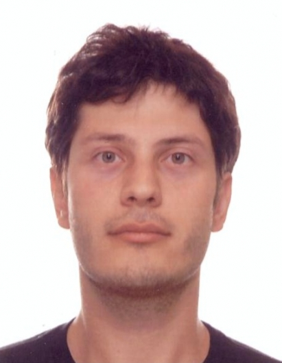

# Ray-casting & Ray-Tracing with VTK

## Introduction
VTK has long evolved beyond just visualization and offers some amazing functionality that just can't be found elsewhere. Such an example would be the ['ray-casting'](http://en.wikipedia.org/wiki/Ray_casting), and consequentially ['ray-tracing'](http://en.wikipedia.org/wiki/Ray_tracing), capabilities provided by the [`vtkOBBTree`](http://www.vtk.org/doc/release/5.2/html/a00908.html) class. With this post I'd like to introduce these capabilities and show examples of ray-casting and ray-tracing performed exclusively through Python, a dash of NumPy, and VTK. 

> Disclaimer: The ray-casting and ray-tracing examples I'll be presenting here are severely condensed versions of my posts ['Ray Casting with Python and VTK: Intersecting lines/rays with surface meshes'](http://pyscience.wordpress.com/2014/09/21/ray-casting-with-python-and-vtk-intersecting-linesrays-with-surface-meshes/) and ['From Ray Casting to Ray Tracing with Python and VTK'](http://pyscience.wordpress.com/2014/10/05/from-ray-casting-to-ray-tracing-with-python-and-vtk/) appearing under my blog [PyScience](http://pyscience.wordpress.com/). If they pique your interest please visit the aforementioned posts where you can find all the material, code (in the form of IPython Notebooks), and an excruciating amount of detail pertaining to each aspect of the process (as these posts were written for people with little to no experience in VTK).

### Ray-Casting vs. Ray-Tracing
I'd like to emphasize a pivotal difference between ['ray-casting'](http://en.wikipedia.org/wiki/Ray_casting) and ['ray-tracing'](http://en.wikipedia.org/wiki/Ray_tracing). In the case of the former we only 'cast' a single ray, test for its intersection with objects, retrieve information regarding the intersection, and stop there. Ray-tracing on the other hand, is more physically accurate as it treats the rays with physics laws on reflection, refraction, attenuation, etc to 'trace', i.e., follow, that ray and its derivative rays. However, ray-casting is the natural precursor to ray-tracing as it tells us what part of which object the ray intersects with and provides all necessary information to cast subsequent rays.

### The `vtkOBBTree` class
The star of this post is the [`vtkOBBTree`](http://www.vtk.org/doc/release/5.2/html/a00908.html) class, which generates an [oriented bounding-box (OBB)](http://en.wikipedia.org/wiki/Minimum_bounding_box) 'tree' for a given geometry under a [vtkPolyData](http://www.vtk.org/doc/nightly/html/classvtkPolyData.html) object. Upon generation of this OBB tree this class allows us to perform intersection tests between the mesh and lines of finite length as well as intersection tests between different meshes. It can then return the point coordinates where intersections were detected as well as the polydata cell IDs where these occurred.

## Ray-Casting with vtkOBBTree
For this demonstration we're assuming that we have a [surface model of a human skull stored in an `.stl` file](https://bitbucket.org/somada141/pyscience/raw/master/20140910_RayCasting/Material/bones.stl) whose contents we've loaded into a [`vtkPolyData`](http://www.vtk.org/doc/nightly/html/classvtkPolyData.html) object named `mesh` through the [`vtkSTLReader`](http://www.vtk.org/doc/nightly/html/classvtkSTLReader.html) class. A rendering of this model through the [`vtkPolyDataMapper`](http://www.vtk.org/doc/nightly/html/classvtkPolyDataMapper.html) class can be seen in Figure 1.


The center of the skull is centered around the cartesian origin, i.e., the `(0.0, 0.0, 0.0)` point. Now let's assume we want to cast a ray emanating from `(100.0, 100.0, 0.0)` and ending at `(0.0, 0.0, 0.0)` and retrieve the coordinates of the points where this ray intersects with the skull surface. A rendering including the ray, prior to actually casting it, can be seen in Figure 2.


Prior to intersection, we need to create and initialize a new [vtkOBBTree](http://www.vtk.org/doc/release/5.2/html/a00908.html) with the [`vtkPolyData`](http://www.vtk.org/doc/nightly/html/classvtkPolyData.html) object of our choice, called `mesh` in our case. This is done as follows:

```
obbTree = vtk.vtkOBBTree()
obbTree.SetDataSet(mesh)
obbTree.BuildLocator()
```

Note the call to the `BuildLocator` method which creates the OBB tree. That's it! We now have a world-class intersection tester at our disposal. At this point we can use the `IntersectWithLine` method of the [`vtkOBBTree`](http://www.vtk.org/doc/release/5.2/html/a00908.html) class to test for intersection with the aforementioned ray. We merely need to create a [`vtkPoints`](http://www.vtk.org/doc/nightly/html/classvtkPoints.html) and a [`vtkIdList`](http://www.vtk.org/doc/nightly/html/classvtkIdList.html) object to store the results of the intersection test:

```
points = vtk.vtkPoints()
cellIds = vtk.vtkIdList()

code = obbTree.IntersectWithLine((100.0, 100.0, 0.0), 
                                 (0.0, 0.0, 0.0), 
                                 points, 
                                 cellIds)
```

As mentioned above, the `points` and `cellIds` now contain the point coordinates and cell IDs the ray intersected with as it was emanated from the first point, i.e., `(100.0, 100.0, 0.0)`, onto the second, i.e., `(0.0, 0.0, 0.0)`, in the order they were 'encountered'.  The return value `code` is an integer which would be equal to `0` if no intersections were found at all. A rendering showing the intersection points can be seen in Figure 3.


As mentioned at the beginning of this article, the entire process shown above, along with all material and code needed to reproduce it, is detailed in my post ['Ray Casting with Python and VTK: Intersecting lines/rays with surface meshes'](http://pyscience.wordpress.com/2014/09/21/ray-casting-with-python-and-vtk-intersecting-linesrays-with-surface-meshes/).

> The Python package [`pycaster`](https://pypi.python.org/pypi/pycaster) wraps the functionality shown above, assuming no VTK experience, and provides additional methods to calculate the distance a given ray has 'traveled' within a closed surface. It is currently being [served through PyPI](https://pypi.python.org/pypi/pycaster), while the repository can be found on BitBucket [here](https://bitbucket.org/somada141/pycaster).

## Ray-Tracing with vtkOBBTree
Now in order to perform ray-tracing we can take the lessons learned from ray-casting and apply them to a more convoluted scenario. The rationale behind ray-tracing with the [`vtkOBBTree`](http://www.vtk.org/doc/release/5.2/html/a00908.html) class is the following:

- Cast rays from every 'ray source' and test for their intersection with every 'target' mesh in the scene.
- If a given ray intersects with a given 'target' then use the intersection points and intersected cells in order to calculate the normal at that cell, calculate the vectors of the reflected/refracted rays, and cast subsequent rays off the target. 

	> An excellent, freely available, article entitled ['Reflections and Refractions in Ray-Tracing'](http://graphics.stanford.edu/courses/cs148-10-summer/docs/2006--degreve--reflection_refraction.pdf) (Bram de Greve, 2006) provides a good overview of the math and physics behind ray-tracing. 
	
- Repeat this process for every ray cast from the 'ray source'.

Let's assume a scene comprising a half-sphere dubbed `sun`, which will act as the ray-source, and a larger nicely textured sphere called `earth`, which will be the target of those rays. This 'environment' can be seen in Figure 4.


In this example, we will be casting a ray from the center of each triangular cell on the `sun` surface along the direction of that cell's normal vector. The `sun` cell-centers were calculated through the [`vtkCellCenters`](http://www.vtk.org/doc/nightly/html/classvtkCellCenters.html) class and stored under `pointsCellCentersSun` (of type [`vtkPolyData`](http://www.vtk.org/doc/nightly/html/classvtkPolyData.html)). The `sun` cell-normals were calculated through the [`vtkPolyDataNormals`](http://www.vtk.org/doc/nightly/html/classvtkPolyDataNormals.html) class and stored under `normalsSun` (of type [`vtkFloatArray`](http://www.vtk.org/doc/nightly/html/classvtkFloatArray.html)). A rendering of the cell-centers as points and cell-normals as glyphs, through the [`vtkGlyph3D`](http://www.vtk.org/doc/nightly/html/classvtkGlyph3D.html) class, can be seen in Figure 5.


Similarly to what was done in the previous example, prior to ray-casting we first need to create a [`vtkOBBTree`](http://www.vtk.org/doc/release/5.2/html/a00908.html) object for the `earth`:

```
obbEarth = vtk.vtkOBBTree()
obbEarth.SetDataSet(earth.GetOutput())
obbEarth.BuildLocator()
```

Now since we'll be casting a large number of rays let's wrap the [`vtkOBBTree`](http://www.vtk.org/doc/release/5.2/html/a00908.html) functionality in two convenient functions:

```
def isHit(obbTree, pSource, pTarget):
    code = obbTree.IntersectWithLine(pSource, 
                                     pTarget, 
                                     None, 
                                     None)
    if code==0:
        return False
    return True

def GetIntersect(obbTree, pSource, pTarget):
    points = vtk.vtkPoints()
    cellIds = vtk.vtkIdList()
    
    # Perform intersection test
    code = obbTree.IntersectWithLine(pSource, 
                                     pTarget, 
                                     points, 
                                     cellIds)
    
    pointData = points.GetData()
    noPoints = pointData.GetNumberOfTuples()
    noIds = cellIds.GetNumberOfIds()
    
    pointsInter = []
    cellIdsInter = []
    for idx in range(noPoints):
        pointsInter.append(pointData.GetTuple3(idx))
        cellIdsInter.append(cellIds.GetId(idx))
    
    return pointsInter, cellIdsInter
```

The `isHit` function will simply return `True` or `False` depending on whether a given ray intersects with `obbTree`, which in our case will only be `obbEarth`. 

The `GetIntersect` function simply wraps the functionality we saw in the first example.  In a nutshell it will return two `list` objects `pointsInter` and `cellIdsInter`. The former will contain a series of `tuple` objects with the coordinates of the intersection points. The latter will contain the 'id' of the mesh cells that were 'hit' by that ray. This information is vital as through these ids we'll be able to get the correct normal vector for that `earth` cell and calculate the appropriate reflected vector as we'll see below.

At this point we're ready to perform the ray-tracing. Let's take a look at a condensed version of the code:

```
for idx in range(pointsCellCentersSun.GetNumberOfPoints()):
    pointSun = pointsCellCentersSun.GetPoint(idx)
    normalSun = normalsSun.GetTuple(idx)
    
    # Calculate the 'target' of the 'sun' ray based on 'RayCastLength'
    pointRayTarget = list(numpy.array(pointSun) +
                          RayCastLength*numpy.array(normalSun))
    
    if isHit(obbEarth, pointSun, pointRayTarget):
        pointsInter, cellIdsInter = GetIntersect(obbEarth, 
                                                 pointSun, 
                                                 pointRayTarget)
        # Get the normal vector at the earth cell that intersected with the ray
        normalEarth = normalsEarth.GetTuple(cellIdsInter[0])

        # Calculate the incident ray vector
        vecInc = (numpy.array(pointRayTarget) - 
                  numpy.array(pointSun))
        # Calculate the reflected ray vector
        vecRef = (vecInc - 2*numpy.dot(vecInc, 
                                       numpy.array(normalEarth)) * numpy.array(normalEarth))
        
        # Calculate the 'target' of the reflected ray based on 'RayCastLength'
        pointRayReflectedTarget = (numpy.array(pointsInter[0]) +
                                  RayCastLength*l2n(vecRef))
```

Please note that all rendering code was removed from the above snippet but you can see the entire code in the [original post](http://pyscience.wordpress.com/2014/10/05/from-ray-casting-to-ray-tracing-with-python-and-vtk/). What is done above in a nutshell is the following:

- We loop through every cell-center on the `sun` mesh (`pointSun`), stored under `pointsCellCentersSun`.
- We cast a ray along the direction of that `sun` cell's normal vector, stored under `normalsSun`. The ray emanates from `pointSun` to `pointRayTarget`.
 
	> As the [`vtkOBBTree`](http://www.vtk.org/doc/release/5.2/html/a00908.html) class only allows for intersection tests with lines of finite length, not semi-infinite rays, the rays cast in the code above are given a large (relative to the scene) length to ensure that failure to intersect with `earth` would only be due to the ray's direction and not an insufficient length.

- Every ray is tested for intersection with the `earth` through the `isHit` function and and the `obbEarth` object defined above. 
- If a ray intersects with the `earth`, the intersection test is repeated through the `GetIntersect` function in order to retrieve the intersection point coordinates and the intersected cell IDs on the `earth` mesh. The intersection point coordinates as well as the intersected `earth` cell normal vector (`normalEarth`) are used to calculate the normal vector of the reflected ray and cast that ray off the `earth` surface.
 
	> The cell normals on the `earth` surface were calculated through the [`vtkPolyDataNormals`](http://www.vtk.org/doc/nightly/html/classvtkPolyDataNormals.html) class and stored under `normalsEarth` (of type [`vtkFloatArray`](http://www.vtk.org/doc/nightly/html/classvtkFloatArray.html)), the same way `normalSun` were calculated prior. 

A render of the ray-tracing result can be seen in Figure 6. Note that rays that missed the `earth` are rendered as white. Rays that intersected with `earth` are rendered as yellow. You can also see the intersection points, the normal vectors at the intersected `earth` cells, as well as the reflected rays.


As mentioned at the beginning of this article, the entire process shown above, along with all material and code needed to reproduce it, is detailed in my post ['From Ray Casting to Ray Tracing with Python and VTK'](http://pyscience.wordpress.com/2014/10/05/from-ray-casting-to-ray-tracing-with-python-and-vtk/).

## Conclusion
As you can see that VTK provides some little-known pearls that offer some fantastic functionality. 

While the above examples fall short of real-world ray-tracing applications, as one would need to account effects like refraction and energy attenuation, the sky is the limit!

## Bio



Adamos Kyriakou is an Electrical & Computer Engineer with an MSc. in Telecommunications and a Ph.D. in Biomedical Engineering. He is currently working as a Research Associate in Computational Multiphysics at the IT'IS Foundation (ETH Zurich) where his work and research is primarily focused around computational algorithm development, high-performance computing, multi-physics simulations, big-data analysis, and medical imaging/therapy modalities. He has collaborated with medical & technical personnel, researchers, and industrial partners in large international projects such as, safety evaluation of medical devices, treatment planning & optimization of therapeutic modalities, and development of next-generation simulation platforms.