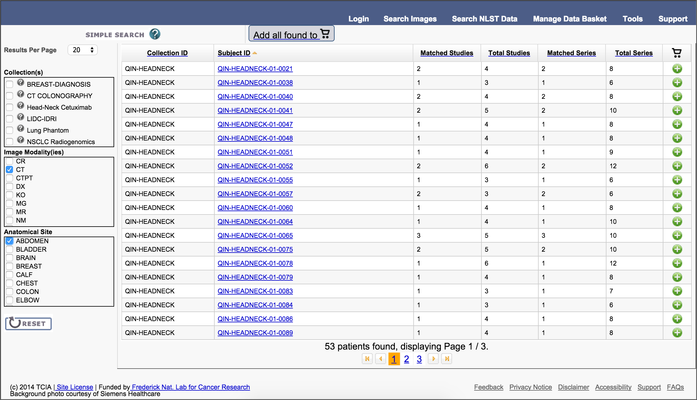
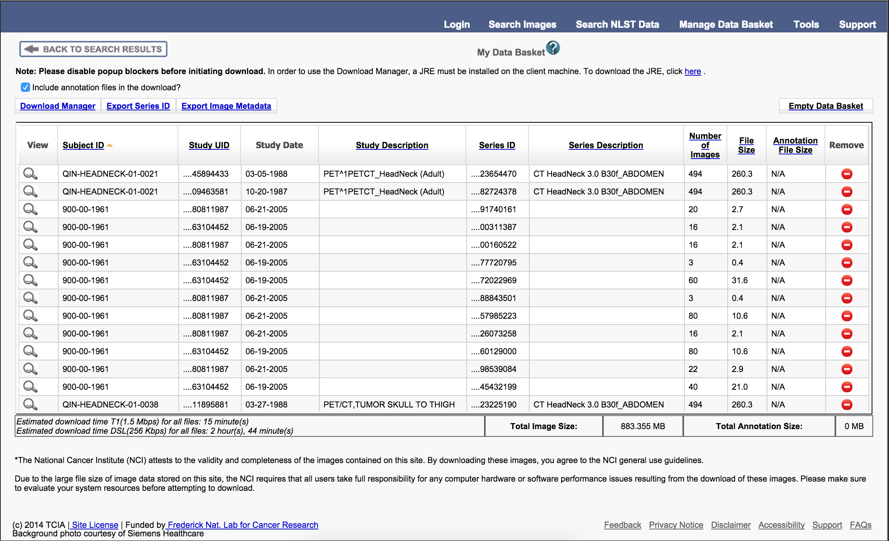

Title: Python access to the Cancer Imaging Archive (TCIA) through a REST API 
Author: Adamos Kyriakou
Date: Tuesday December 9th, 2014
Tags: Python, IPython Notebook, Medical Image Processing, Data Mining, REST, 
Categories: Data Mining, Web

In this post I will talk about the Cancer Imaging Archive, a massive collection of freely available medical image data, and demonstrate how to automatically access and retrieve that data through a Python client tapping into the provided REST API.

<!--more-->

---

# Introduction

## Background

### [The Cancer Imaging Archive (TCIA)](http://www.cancerimagingarchive.net/)

A while back, I mentioned in my previous post about [DICOM file IO in Python](http://pyscience.wordpress.com/2014/09/08/dicom-in-python-importing-medical-image-data-into-numpy-with-pydicom-and-vtk/) that DICOM databases are usually restricting the re-distribution of their data. Well, that was before I discovered the [Cancer Imaging Archive (TCIA)](http://www.cancerimagingarchive.net/).

Per their ['about page'](http://www.cancerimagingarchive.net/about-the-cancer-imaging-archive-tcia/), TCIA is a *"large archive of medical images of cancer accessible for public download. Registering is free. All images are stored in DICOM file format. The images are organized as “Collections”, typically patients related by a common disease (e.g. lung cancer), image modality (MRI, CT, etc) or research focus."*. In a nutshell, this is a **fantastic resource** for those who delve into medical image processing and I thought it would be criminal not to promote it :).

A summary of the available image 'collections' can be seen on the [TCIA homepage](http://www.cancerimagingarchive.net/), while a more comprehensive overview can be seen [here](https://wiki.cancerimagingarchive.net/display/Public/Collections). 

#### Image acquisition interface

The image data is all accessible through the primary [TCIA 'search' interface](https://public.cancerimagingarchive.net/ncia) and general instructions on its usage can be found [here](http://www.cancerimagingarchive.net/getting-access-to-the-images/). In addition, many of the collections come with auxiliary data information on which can be found under [this link](http://www.cancerimagingarchive.net/download-supporting-data/).

This 'primary' interface allows the user to filter the existing datasets by selecting the modality, anatomical region, and collection name. A series of 'results' is then presented where the user can click an 'add to cart' icon, thus collecting all series one wants to download. This interface can be seen in the next figure.

 Once done, one can 'checkout', i.e., download, all series by clicking the 'Manage Data Basket' button and using the 'Download Manager' button to download a little Java executable which can download all the series into a folder on your computer.
 
 

#### REST API interface

Now I don't want to come across like an ungrateful jackass, the TCIA people provide an invaluable service and enough image data to spend 3 lifetimes segmenting. However, I found the aforementioned interface to be slow, unresponsive, unintuitive, prone to timeouts, and overall archaic. It really overshadows the quality of the archive.

Thankfully, someone in the TCIA team probably shared my distaste for the conventional interface and decided to provide an [REST API](https://wiki.cancerimagingarchive.net/display/Public/TCIA+Programmatic+Interface+%28REST+API%29+Usage+Guide) for this service which allows a user with basic development skills to access and retrieve all available image datasets programmatically.  Per the API documentation the *"API is a RESTful interface, accessed through web URLs.  There is no software that an application developer needs to download in order to use the API. The application developer can build their own access routines using just the API documentation provided.  The interface employs a set of predefined query functions (see REST API Directory) that access TCIA databases"*.

## Summary
In today's I'll show you how to access the TCIA databases through a Python client written to take advantage of their REST API

# API

## API Key
As clearly stated in the TCIA API documentation, one needs an API key to access the interface. Unfortunately, there's no automatized way to acquire such a key and one would have to email [`help@cancerimagingarchive.net`](mailto:help@cancerimagingarchive.net) and kindly ask them for one. However, I've done so already so feel free to use mine within reason to try out the interface. 

Should you want to use the API extensively please acquire your own key cause I'd hate for them to ban me :D.

My API key, which is included in [today's notebook](), is `16ade9bc-f2fa-4a37-b357-36466a0020fc` which can be used directly with the API client, which is discussed below.

## Python Client
The TCIA API is a typical RESTful API which works pretty straightforwardly with HTTP requests. However, should you be using Python, or Java, there's no need for you to put together your own API client code. 

The TCIA folk were kind enough to put together such a client for you which is hosted under Bitbucket in the unfortunately named [`TCIA-REST-API-Client` repo](https://bitbucket.org/ashishsharma/tcia-rest-api-example). A cleaned-up Python-only subset of that repo can be found in my fork [here](https://bitbucket.org/somada141/tciapy).

What you need to do is download the `tciaclient.py` file, either [from my repo fork](https://bitbucket.org/somada141/tciapy/src/raw/tciaclient.py), [from the PyScience repo](), or [from the TCIA repo](https://bitbucket.org/ashishsharma/tcia-rest-api-example/src/raw/tcia-rest-client-python/src/tciaclient.py), and place it alongside [today's notebook](). With that in place you're ready to try it out :).

# Python REST API access to TCIA

## Imports

