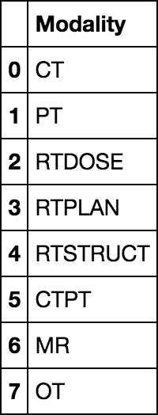

Title: Python access to the Cancer Imaging Archive (TCIA) through a REST API 
Author: Adamos Kyriakou
Date: Tuesday December 9th, 2014
Tags: Python, IPython Notebook, Medical Image Processing, Data Mining, REST, 
Categories: Data Mining, Web

In this post I will talk about the Cancer Imaging Archive, a massive collection of freely available medical image data, and demonstrate how to automatically access and retrieve that data through a Python client tapping into the provided REST API.

<!--more-->

---

# Introduction

## Background

### [The Cancer Imaging Archive (TCIA)](http://www.cancerimagingarchive.net/)

A while back, I mentioned in my previous post about [DICOM file IO in Python](http://pyscience.wordpress.com/2014/09/08/dicom-in-python-importing-medical-image-data-into-numpy-with-pydicom-and-vtk/) that DICOM databases are usually restricting the re-distribution of their data. Well, that was before I discovered the [Cancer Imaging Archive (TCIA)](http://www.cancerimagingarchive.net/).

Per their ['about page'](http://www.cancerimagingarchive.net/about-the-cancer-imaging-archive-tcia/), TCIA is a *"large archive of medical images of cancer accessible for public download. Registering is free. All images are stored in DICOM file format. The images are organized as “Collections”, typically patients related by a common disease (e.g. lung cancer), image modality (MRI, CT, etc) or research focus."*. In a nutshell, this is a **fantastic resource** for those who delve into medical image processing and I thought it would be criminal not to promote it :).

A summary of the available image 'collections' can be seen on the [TCIA homepage](http://www.cancerimagingarchive.net/), while a more comprehensive overview can be seen [here](https://wiki.cancerimagingarchive.net/display/Public/Collections). 

#### Image acquisition interface

The image data is all accessible through the primary [TCIA 'search' interface](https://public.cancerimagingarchive.net/ncia) and general instructions on its usage can be found [here](http://www.cancerimagingarchive.net/getting-access-to-the-images/). In addition, many of the collections come with auxiliary data information on which can be found under [this link](http://www.cancerimagingarchive.net/download-supporting-data/).

This 'primary' interface allows the user to filter the existing datasets by selecting the modality, anatomical region, and collection name. A series of 'results' is then presented where the user can click an 'add to cart' icon, thus collecting all series one wants to download. This interface can be seen in the next figure.


 Once done, one can 'checkout', i.e., download, all series by clicking the 'Manage Data Basket' button and using the 'Download Manager' button to download a little Java executable which can download all the series into a folder on your computer.
 
 

#### REST API interface

Now I don't want to come across like an ungrateful jackass, the TCIA people provide an invaluable service and enough image data to spend 3 lifetimes segmenting. However, I found the aforementioned interface to be slow, unresponsive, unintuitive, prone to timeouts, and overall archaic. It really overshadows the quality of the archive.

Thankfully, someone in the TCIA team probably shared my distaste for the conventional interface and decided to provide an [REST API](https://wiki.cancerimagingarchive.net/display/Public/TCIA+Programmatic+Interface+%28REST+API%29+Usage+Guide) for this service which allows a user with basic development skills to access and retrieve all available image datasets programmatically.  Per the API documentation the *"API is a RESTful interface, accessed through web URLs.  There is no software that an application developer needs to download in order to use the API. The application developer can build their own access routines using just the API documentation provided.  The interface employs a set of predefined query functions (see REST API Directory) that access TCIA databases"*.

It is certainly worth mentioning that the TCIA API is [available for tinkering on Mashape](https://www.mashape.com/tcia/the-cancer-imaging-archive), for which however you still need your own API key.

## Summary
In today's I'll show you how to access the TCIA databases through a Python client written to take advantage of their REST API

# API

## API Key
As clearly stated in the [TCIA API documentation](https://wiki.cancerimagingarchive.net/display/Public/TCIA+Programmatic+Interface+%28REST+API%29+Usage+Guide), one needs an API key to access the interface. Unfortunately, there's no automatized way to acquire such a key and one would have to email [`help@cancerimagingarchive.net`](mailto:help@cancerimagingarchive.net) and kindly ask them for one. However, I've done so already so feel free to use mine within reason to try out the interface. 

Should you want to use the API extensively please acquire your own key cause I'd hate for them to ban me :D.

My API key, which is included in [today's notebook](http://nbviewer.ipython.org/urls/bitbucket.org/somada141/pyscience/raw/master/20141209_TCIA/Material/TCIA.ipynb), is `16ade9bc-f2fa-4a37-b357-36466a0020fc` which can be used directly with the API client, which is discussed below.

## Python Client
The TCIA API is a typical RESTful API which works pretty straightforwardly with HTTP requests. However, should you be using Python, or Java, there's no need for you to put together your own API client code. 

The TCIA folk were kind enough to put together such a client for you which is hosted under Bitbucket in the unfortunately named [`TCIA-REST-API-Example` repo](https://bitbucket.org/ashishsharma/tcia-rest-api-example). A cleaned-up Python-only subset of that repo can be found in my fork [here](https://bitbucket.org/somada141/tciapy).

# Python REST API access to TCIA
What you need to do in order to try out the presented code is download the `tciaclient.py` file, either [from my repo fork](https://bitbucket.org/somada141/tciapy/src/raw/tciaclient.py), [from the PyScience repo](), or [from the TCIA repo](https://bitbucket.org/ashishsharma/tcia-rest-api-example/src/raw/tcia-rest-client-python/src/tciaclient.py), and place it alongside [today's notebook](). With that in place you're ready to try it out :).

## Imports
As always, let us start with the imports:

```
import tciaclient
import pandas
```

As you can see, we start by importing `tciaclient` which contains the simple client class through which we'll access the TCIA servers. 

Next, we import `pandas`, which we'll use to very easily and cleanly read in the [`JSON`](http://en.wikipedia.org/wiki/JSON) responses as they're returned from the TCIA servers. Now if you don't know what `pandas` is/does then I can't help you, this tutorial won't focus on that but feel free to visit the official [`pandas` website](http://pandas.pydata.org/).

## Helper-Functions
For the purposes of this tutorial, we're defining a single `helper-function` at the  beginning of [today's notebook](http://nbviewer.ipython.org/urls/bitbucket.org/somada141/pyscience/raw/master/20141209_TCIA/Material/TCIA.ipynb) and use it throughout. 

This function is `getResponseString(response)` and its code can be seen below:

```
def getResponseString(response):
    if response.getcode() is not 200:
        raise ValueError("Server returned an error")
    else:
        return response.read()
```

What this simple function does is take the server 'response', as returned from the different client methods which we'll see later, ensure that the process was successful, and read whatever data that response included as a string which it then returns.

This is super-basic Pythonic web-dev stuff but if you don't understand it don't fret, you don't really need to. Just read on :).

## API Settings
Now, when we create a new client-object we need to provide some configuration options, which I'll define a-priori so as to make their purpose clear. Take a look at the code below:

```
# CAUTION: You can use my API key for your experiments but 
# please try not to get me banned :). Thanks!
api_key = "16ade9bc-f2fa-4a37-b357-36466a0020fc"
baseUrl="https://services.cancerimagingarchive.net/services/v3"
resource = "TCIA"
```

Firstly, we need to specify the API key, which will give us access to the server API. As I mentioned prior, I've acquired such a key and I'm sharing it with you so that you can test this code out. However, please do not abuse it and should you need to access TCIA consistently please do email [help@cancerimagingarchive.net](mailto:help@cancerimagingarchive.net) and request one of your own.

Next, we define the base URL through which we'll be querying the server. Please to the [API Usage Guide](https://wiki.cancerimagingarchive.net/display/Public/TCIA+Programmatic+Interface+%28REST+API%29+Usage+Guide) for details on this one. One think to note is the `v3` at the end of the URL. TCIA has been constantly updating their API (it went from v1 to v3 in a couple of months) so if you use this service a lot you might want to keep up with changes and updates. Lastly, we define the 'resource' which I don't even know what it does, just following the usage guide's instructions.

## Accessing Basic Information
Now we're ready to tap into the amazing resource that is TCIA! Let's first create the client object:

```
client = tciaclient.TCIAClient(api_key, baseUrl, resource)
```

Yep, that's all it takes. We simply create a new `TCIAClient` object (nestled within the `tciaclient` module imported in the beginning) and store it as `client`. Note how we pass the 'API Settings' we defined prior. Now let's finally start querying!

### Query Imaging Modalities
One of the methods offered by the `TCIAClient` class is `get_modality_values`. While the class isn't documented/commented much the methods are pretty self-explanatory. Let's see this method's signature through `help(client.get_modality_values)` which returns the following:

```
Help on method get_modality_values in module tciaclient:

get_modality_values(self, collection=None, bodyPartExamined=None, modality=None, outputFormat='json') method of tciaclient.TCIAClient instance
```

As you can see, we can query for all medical imaging modalities utilized in the different collections and series of medical image data. We can further filter the returned results by specifying the examined anatomical site `bodyPartExamined` or particular `collection` as a string. We can also specify the file-format of the server response which defaults to JSON but can return several other formats such as CSV, HTML, or XML. However, lets just retrieve all utilized modalities included in the TCIA. This is done as follows:

```
response = client.get_modality_values()
strRespModalities = getResponseString(response)

pandas.io.json.read_json(strRespModalities)
```

As the different arguments of the `get_modality_values` method are all optional we don't need to 'filter' the results so we call it without any arguments. We then merely 'read' the data stored in the `response` using the `getResponseString` helper-function and store the results, as a string, under `strRespBodyParts`.

Now the contents of the `strRespBodyParts` string are a JSON file which we can read in a myriad of ways. However, I chose to use `pandas` which has built-in JSON support and which returns a very powerful [`pandas.DataFrame`](http://pandas.pydata.org/pandas-docs/dev/generated/pandas.DataFrame.html) object, which as we'll see later on is a godsend.  In addition, IPython Notebook has built-in support for [`pandas.DataFrame`](http://pandas.pydata.org/pandas-docs/dev/generated/pandas.DataFrame.html) objects and displays a beautiful table which, for the above code, can be seen in the next figure. 



### Query Anatomical Sites
Another method offered by the `TCIAClient` class is `get_body_part_values` which allows us to query all anatomical sites examined in the different image data series available on TCIA. Let's see this method's signature through `help(client.get_body_part_values)` which returns the following:

```
Help on method get_body_part_values in module tciaclient:

get_body_part_values(self, collection=None, bodyPartExamined=None, modality=None, outputFormat='json') method of tciaclient.TCIAClient instance
```

Similarly to the case of the 'get_modality_values' method, you can see its possible to filter the returned results by specifying the imaging `modality` or particular `collection` etc. However, lets once more retrieve **all** anatomical sites by using the defaults arguments:

```
response = client.get_body_part_values()
strRespBodyParts = getResponseString(response)

pandas.io.json.read_json(strRespBodyParts)
```

You can obviously see that the code is nearly identical to the one we used to retrieve the imaging modalities, this ain't rocket science :). The above code will display a nice table with all anatomical sites, part of which you can see in the next figure.